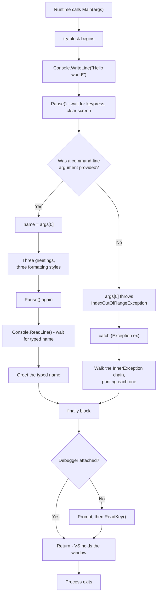
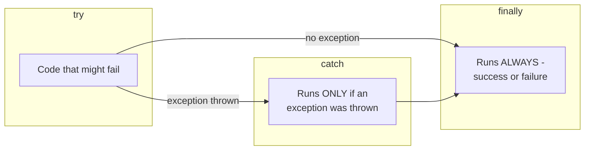
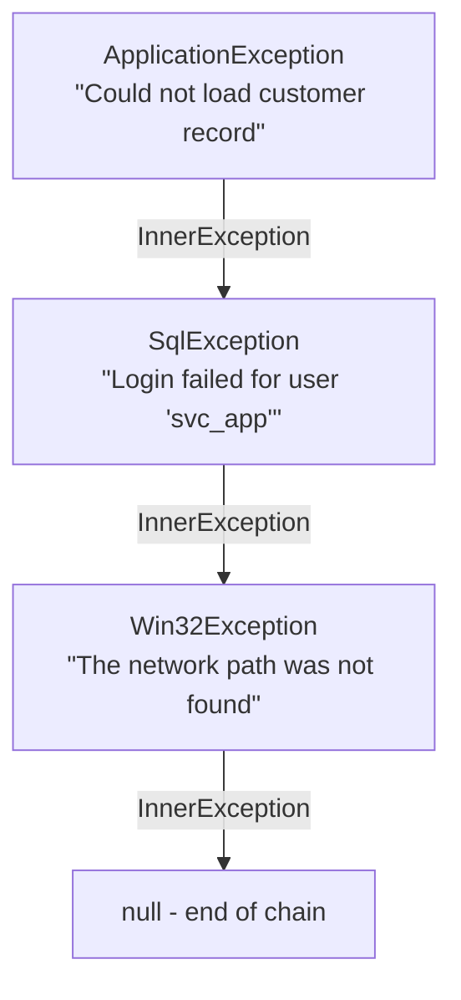
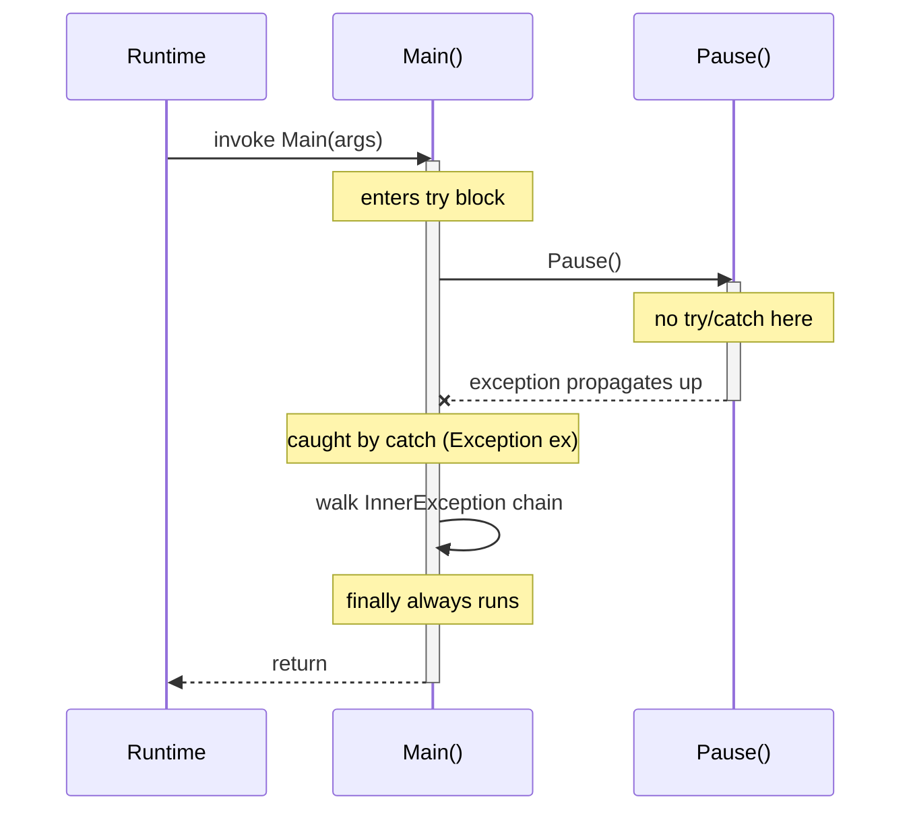

# Chapter 1 - Hello World

> **Project:** `CSharp.Ch01.HelloWorld`
> **Type:** Console application (`Exe`)
> **Target Framework:** `net48` (inherited from `Directory.Build.props`)
> **Prerequisites:** None. This is the front door.

---

## Table of Contents

1. [What You'll Learn](#what-youll-learn)
2. [Why Hello World Still Earns Its Keep](#why-hello-world-still-earns-its-keep)
3. [The Project File](#the-project-file)
4. [The Shape of the File](#the-shape-of-the-file)
5. [Regions: Comments That Fold](#regions-comments-that-fold)
6. [Using Directives](#using-directives)
7. [The Entry Point](#the-entry-point)
8. [Execution Flow](#execution-flow)
9. [Three Ways to Put a Variable in a String](#three-ways-to-put-a-variable-in-a-string)
10. [The Deliberate Landmine: `args[0]`](#the-deliberate-landmine-args0)
11. [try / catch / finally](#try--catch--finally)
12. [Walking the Exception Chain](#walking-the-exception-chain)
13. [Reading Input](#reading-input)
14. [The `Pause()` Helper and Exception Bubbling](#the-pause-helper-and-exception-bubbling)
15. [Run It Yourself](#run-it-yourself)
16. [Common Mistakes](#common-mistakes)
17. [Exercises](#exercises)
18. [Key Terms](#key-terms)
19. [Where This Goes Next](#where-this-goes-next)

---

## What You'll Learn

By the end of this lesson you should be able to:

- Identify the entry point of a .NET console application and explain what `args` contains
- Write output to the console using three different string-formatting styles, and argue for one
- Read interactive input from the user
- Structure a method with `try` / `catch` / `finally` and explain what each block guarantees
- Walk a chain of inner exceptions to find the *actual* cause of a failure
- Explain what `#region` does to the compiled output (spoiler: nothing whatsoever)
- Describe how an exception thrown in a called method reaches a `catch` block in its caller

---

## Why Hello World Still Earns Its Keep

Every programming course in recorded history opens with Hello World, and it would be easy to write that off as ceremony. It isn't. Printing one line of text is the smallest possible end-to-end proof that your entire toolchain is functional: the compiler found your source, the build produced an assembly, the runtime loaded it, and the characters you typed came out the other end in the right order.

That's four separate things that can each fail independently, and if any one of them is broken, you very much want to discover it now - while the only variable in play is a greeting - rather than three chapters from now, when you're debugging a database call and can't tell whether the problem is your LINQ or your entire installation.

This particular Hello World is unusually chatty for the genre. It does the traditional one-liner and then keeps going, using the remaining hundred-odd lines to quietly introduce about six concepts you'll use in every program you write from here on. It also contains a bug on purpose, which we'll get to.

---

## The Project File

The `.csproj` is almost aggressively boring, and that's the point:

```xml CSharp.Ch01.HelloWorld\CSharp.Ch01.HelloWorld.csproj
<Project Sdk="Microsoft.NET.Sdk">

  <PropertyGroup>
    <OutputType>Exe</OutputType>
    <RootNamespace>CSharp.Ch01.HelloWorld</RootNamespace>
    <AssemblyName>CSharp.Ch01.HelloWorld</AssemblyName>
  </PropertyGroup>

</Project>
```

Three properties. No target framework, no language version, no package references. If you've seen older `.csproj` files - the kind that listed every single `.cs` file in the project by name, in XML, by hand - this will look suspiciously empty.

Two things are doing the heavy lifting:

- **The SDK-style project format.** `Sdk="Microsoft.NET.Sdk"` brings in a mountain of default behavior, including "compile every `.cs` file in this folder and below." You add a file, it gets compiled. No XML edit required.
- **`Directory.Build.props` at the solution root.** This is where `TargetFramework` (`net48`), `LangVersion` (`latest`), `ImplicitUsings` (`disable`), and `Nullable` (`disable`) are set once for every project in the solution.

```xml Directory.Build.props
<PropertyGroup>
  <TargetFramework>net48</TargetFramework>
  <LangVersion>latest</LangVersion>
  <ImplicitUsings>disable</ImplicitUsings>
  <Nullable>disable</Nullable>
  <Deterministic>true</Deterministic>
  <AutoGenerateBindingRedirects>true</AutoGenerateBindingRedirects>
  <FileAlignment>512</FileAlignment>
</PropertyGroup>
```

`OutputType=Exe` is the one genuinely load-bearing line in the project file: it tells the build to produce a runnable `.exe` with a console window attached, rather than a `.dll` that other code has to call into.

Note `ImplicitUsings` is **disabled** solution-wide. In a modern .NET template, `using System;` is injected for you invisibly. Here it isn't - you'll write your `using` directives yourself, explicitly, in every file. For a training set that's a feature: nothing is hidden, and you can see exactly which namespace each type came from.

---

## The Shape of the File

Before diving into the code, here's the skeleton of `Program.cs`, with the bodies stripped out:

```csharp CSharp.Ch01.HelloWorld\Program.cs
#region Copyright
/* ... DataBank IMX copyright header ... */
#endregion

#region Textbook Information
/* ... source textbook, ISBN, errata links ... */
#endregion

#region Further Reading
// ... links to Microsoft Learn ...
#endregion

#region Using Directives
using System;
using System.Diagnostics;
#endregion

namespace CSharp.Ch01.HelloWorld
{
    internal static class Program
    {
        #region Main Executable Method
        private static void Main(string[] args) { /* ... */ }
        #endregion

        #region Helper Functions
        private static void Pause() { /* ... */ }
        #endregion
    }
}

#region Source Code Information
/* ... reuse-not-permitted footer ... */
#endregion
```

Roughly a third of this file is header comments and structural markers before a single executable statement appears. That ratio is deliberate and it's the house style throughout this solution - copyright block, provenance, further reading, then directives, then code. You'll see the same skeleton in all 150-odd projects, which means once you can navigate one file you can navigate all of them.

The class itself:

```csharp
internal static class Program
```

- **`internal`** - visible only within this assembly. Nothing outside `CSharp.Ch01.HelloWorld.exe` has any business calling into it.
- **`static`** - cannot be instantiated. You will never write `new Program()`, and marking it `static` makes the compiler enforce that rather than leaving it as a gentleman's agreement.

---

## Regions: Comments That Fold

```csharp
#region Using Directives
using System;
using System.Diagnostics;
#endregion
```

The source itself flags this early:

> ```
> // Using the #region decoration has no effect on the compiled code at runtime,
> //   but it does provide a way to easily mark functional areas in the code for debugging and support
> ```

`#region` is a **preprocessor directive**. The compiler notes it, uses it for absolutely nothing, and emits identical IL whether it's there or not. Its entire purpose is to let your editor collapse a block behind a labeled `[+]`.

This is a mild religious war in C# circles. The case against is that regions are often used to hide the fact that a class has grown to four thousand lines and does nine unrelated things - folding the mess doesn't clean it up. The case for is that in a *teaching* codebase, being able to collapse a 30-line copyright banner to one line is genuinely pleasant.

This solution uses them heavily and consistently. Take it as house style rather than universal law; you'll meet teams that ban them outright.

> **Try it:** In Visual Studio, press `Ctrl+M`, `Ctrl+O` to collapse every region in the file at once, then `Ctrl+M`, `Ctrl+L` to expand everything again. On a file this size it's a party trick. On a two-thousand-line legacy class it's survival.

---

## Using Directives

```csharp
using System;
using System.Diagnostics;
```

A `using` directive doesn't *import* code in the sense of copying anything - nothing is pulled in, no file is loaded. It simply tells the compiler: "when I write an unqualified type name, also look in this namespace."

Without `using System;`, every call would need its full address:

```csharp
System.Console.WriteLine("Hello world!");   // works without the using directive
Console.WriteLine("Hello world!");          // needs using System;
```

The two directives here earn their place as follows:

| Namespace | Provides | Used for |
|---|---|---|
| `System` | `Console`, `Exception`, `string` | All output, input, and exception handling |
| `System.Diagnostics` | `Debugger` | The `Debugger.IsAttached` check in `finally` |

That second one is easy to forget, and the error message you get if you do - *"The name 'Debugger' does not exist in the current context"* - is one you'll see a hundred thousand more times in your career. It nearly always means a missing `using`, not missing code.

---

## The Entry Point

```csharp
private static void Main(string[] args)
```

Every runnable .NET program has exactly one entry point: a method named `Main` that the runtime calls first. Breaking down the signature piece by piece:

| Part | Meaning |
|---|---|
| `private` | Nothing else in your code can call it. The runtime invokes it via a special mechanism that ignores accessibility. |
| `static` | Belongs to the type, not an instance. It must be - there's no object to call it on yet, since the program hasn't started. |
| `void` | Returns nothing. An `int` return is also legal and becomes the process exit code. |
| `string[] args` | Command-line arguments, already split on whitespace by the runtime. |

The comment in the source makes the naming point explicitly:

> ```
> // By default, in a console (CMD window) project, the runnable class is called "Program"
> // You can change this if desired
> ```

The class name is pure convention. The runtime hunts for a `Main` method; it never looks at what the enclosing class is called. You could rename `Program` to `Aardvark` and the program would behave identically. (You should not do this.)

### Understanding `args`

Given this at a terminal:

```pwsh
.\CSharp.Ch01.HelloWorld.exe Ada Lovelace
```

You get:

| Expression | Value |
|---|---|
| `args.Length` | `2` |
| `args[0]` | `"Ada"` |
| `args[1]` | `"Lovelace"` |
| `args[2]` | 💥 `IndexOutOfRangeException` |

Run it bare, with no arguments, and `args` is an **empty array** - length zero. Critically, it is *not* `null`. This distinction matters enormously in about ninety seconds.

> **Note:** The program name itself is *not* in `args`. In C and C++, `argv[0]` is the executable path; .NET drops it. If you want it, ask `Environment.GetCommandLineArgs()` instead, which does include it at index 0.

---

## Execution Flow

Here's what actually happens, start to finish:



Note the two paths converging on `finally`. Whether the program sailed through or blew up on `args[0]`, that block runs. That guarantee is the entire reason `finally` exists.

---

## Three Ways to Put a Variable in a String

The program greets you by name three times in a row. This looks redundant, and mechanically it is - all three lines produce byte-identical output. The point is historical:

```csharp CSharp.Ch01.HelloWorld\Program.cs
// The classic way to embed a variable value in a string is using string.Format
Console.WriteLine(string.Format("Hello {0}!", name));

// The WriteLine() method can interpolate formatting without needing "string.Format"
Console.WriteLine("Hello {0}!", name);

// In newer versions of C#, we can accomplish the same thing using string interpolation
Console.WriteLine($"Hello {name}!");
```

### Style 1 - `string.Format`

`{0}` is a **placeholder** referring to the first argument after the format string. `{1}` would be the second, and so on. This idiom traces back through Java and ultimately to C's `printf`, and it's been in .NET since version 1.0.

It's also the most error-prone of the three. Nothing checks at compile time that your placeholder indices line up with the arguments you supplied. Write `"Hello {1}!"` with only one argument and you get a `FormatException` at runtime - a failure that a typo introduced and the compiler cheerfully ignored.

### Style 2 - `WriteLine`'s built-in overload

`Console.WriteLine` has an overload taking a format string plus arguments, so wrapping the call in `string.Format` is pure ceremony. This version is strictly shorter with identical behavior and identical failure modes.

### Style 3 - String interpolation (C# 6+)

The `$` prefix makes the whole literal an **interpolated string**, and the expression goes directly inside the braces where it's used. No index counting, no separate argument list.

The decisive advantage is compile-time checking: misspell `name` as `nmae` and the build fails immediately with *"The name 'nmae' does not exist in the current context."* The other two styles would happily compile and then fail - or worse, silently misbehave - at runtime.

You can also put real expressions inside, not just variable names:

```csharp
Console.WriteLine($"Hello {name.ToUpper()}! Your name has {name.Length} letters.");
```

### Which should you use?

**Interpolation, for new code, essentially always.** The other two are here so you can *read* them - and you will need to, because this solution alone contains code spanning twenty years of C# idiom, and the wider world is worse. Recognizing all three is a reading skill; writing the third is a style rule.

---

## The Deliberate Landmine: `args[0]`

```csharp CSharp.Ch01.HelloWorld\Program.cs
// We can modify the printout to greet a person named in a command-line argument
// Note: This will throw an error if no command-line argument is provided
string name = args[0];
```

The comment tells on itself, and this is the most interesting line in the file.

Run the program with no command-line arguments - which is exactly what happens when you press F5 in Visual Studio without configuring anything - and `args` is an empty array. Asking an empty array for element zero throws `IndexOutOfRangeException`, immediately.

This is **intentional**. Chapter 1 wants you to watch an exception happen and get caught, on your very first run, rather than reading about exceptions in the abstract. It's a controlled demolition.

In real code you would guard it. Any of these are fine:

```csharp
// Option 1: check the length first
string name = args.Length > 0 ? args[0] : "world";

// Option 2: bail out early with a useful message
if (args.Length == 0)
{
    Console.WriteLine("Usage: CSharp.Ch01.HelloWorld.exe <name>");
    return;
}
string name = args[0];

// Option 3: LINQ, for when you get to Chapter 7
string name = args.FirstOrDefault() ?? "world";
```

Notice that none of these involve `try`/`catch`. Catching an exception you could have prevented with an `if` is a smell - exceptions are for *exceptional* conditions, not for control flow you can see coming from across the room. "No arguments supplied" is a completely ordinary thing for a user to do.

> **Why is it written the dangerous way here, then?** Because Chapter 1 needs a live exception more than it needs defensive code, and the comment above the line is honest about it. By Chapter 5 you'll be expected to write the guarded version.

---

## try / catch / finally

```csharp CSharp.Ch01.HelloWorld\Program.cs
try
{
    // ... everything the program actually does ...
}
catch (Exception ex)
{
    while (ex != null)
    {
        Console.WriteLine(ex);
        ex = ex.InnerException;
    }
}
finally
{
    if (!Debugger.IsAttached)
    {
        Console.WriteLine("\nDone!\n\nPress any key to exit!");
        Console.ReadKey();
    }
}
```

The source is upfront that this is a preview:

> ```
> // We always surround our code with try/catch, so that we can handle any exceptions that occur
> // You'll learn more about this in chapter 5
> ```

Each block makes a different promise:



| Block | Runs when | Typical use |
|---|---|---|
| `try` | Always - it's the code you're protecting | The actual work |
| `catch` | Only when an exception was thrown | Logging, recovery, user-friendly messages |
| `finally` | Always, exception or not | Cleanup: closing files, releasing connections, keeping windows open |

### Why wrap `Main` at all?

An exception that escapes `Main` entirely is *unhandled*. The runtime terminates the process, and on Windows the console window closes instantly. Your error message technically got printed - for about four milliseconds, into a window that no longer exists. Wrapping `Main` means you get to see what happened.

### The `Debugger.IsAttached` refinement

```csharp
if (!Debugger.IsAttached)
{
    Console.WriteLine("\nDone!\n\nPress any key to exit!");
    Console.ReadKey();
}
```

This is a small quality-of-life touch worth understanding, because you'll want it in your own console apps.

When you run from Visual Studio with the debugger attached (F5), VS already holds the console window open after `Main` returns and shows *"Press any key to close this window."* Adding your own prompt on top means pressing a key **twice**, every single debug session, forever.

When the `.exe` runs on its own - double-clicked from Explorer, or launched by a scheduled task - nothing holds the window open, and without the prompt the output flashes past unreadably.

`Debugger.IsAttached` lets one binary do the right thing in both situations. It's the reason `using System.Diagnostics;` is at the top of the file.

---

## Walking the Exception Chain

This is the most valuable four lines in the file:

```csharp CSharp.Ch01.HelloWorld\Program.cs
// It's important to catch all exceptions down to the root error
// For later lessons, I have moved this to a separate class in the "SharedLibrary" project
while (ex != null)
{
    Console.WriteLine(ex);
    ex = ex.InnerException;
}
```

Exceptions **nest**. When code catches a low-level failure and rethrows something more meaningful, it typically passes the original along as the `InnerException`. Do that a few layers deep and you get a chain:



Print only the outermost exception and your log says *"Could not load customer record."* Cool. Why? No idea. The information you actually need - a bad service-account password, or a network share that vanished - is two links down.

The loop is about as simple as loops get: print the current exception, step to its inner exception, stop when you hit `null`. That `null` terminator is what makes `while (ex != null)` the right shape.

`Console.WriteLine(ex)` implicitly calls `ex.ToString()`, which for an exception yields the type name, the message, and the full stack trace. That's why there's no explicit `.Message` here - you're getting considerably more than the message.

> **Foreshadowing:** the comment mentions this logic moves to `CSharp.SharedLibrary` in later chapters. Writing the same seven-line loop in every program is exactly the kind of duplication that a shared library exists to delete. You'll meet `DatabankException` and its `Log()` method soon enough - this loop is its ancestor.

---

## Reading Input

```csharp CSharp.Ch01.HelloWorld\Program.cs
// We can also take in input from the user
Console.WriteLine("Enter your name to continue...");
name = Console.ReadLine();
Console.WriteLine($"Hello {name}!");
```

`Console.ReadLine()` **blocks**: execution stops dead on that line until the user types something and presses Enter. It returns everything typed, as a `string`, minus the newline.

Two behaviors worth internalizing now:

- Press Enter without typing anything and you get `""` - an empty string, not `null`.
- `Console.ReadLine()` *can* return `null`, but only when standard input reaches end-of-stream - piping a file that runs out, or Ctrl+Z on Windows. Rare interactively, common when scripting.

Note also that `name` is **reassigned** here - it was declared back at `string name = args[0];`. Same variable, new value. Assignment, not declaration.

---

## The `Pause()` Helper and Exception Bubbling

```csharp CSharp.Ch01.HelloWorld\Program.cs
// Pause and await user interaction before executing the next block of code
private static void Pause()
{
    // Notice that I am not including try/catch here
    // Although that is sometimes advantageous, exceptions thrown in a called function
    //   will bubble up to the calling method and can be handled there
    Console.WriteLine($"\nPress any key to continue...");
    Console.ReadKey();
    Console.Clear();
}
```

Mechanically this is three lines: prompt, wait for any single keypress (no Enter required - that's `ReadKey` versus `ReadLine`), then wipe the screen.

The comment is teaching something much more important than the method does.

### Exception bubbling

If `Pause()` threw an exception, it has no `try`/`catch` of its own - so the exception doesn't stop there. It propagates *up the call stack* to whoever called `Pause()`, which is `Main`, which does have a `catch`. It gets handled there.



This is why you do **not** need `try`/`catch` in every method. A common beginner instinct is to wrap everything defensively, which produces code that's mostly error handling and where the same failure gets logged five times on its way up.

The rule of thumb: **catch an exception where you can actually do something about it.** If a method can't meaningfully recover, letting the exception rise to a caller who can is not laziness - it's correct design.

### On `Console.Clear()`

Clearing the screen is a teaching device - it keeps each demonstration section visually separate. Do not ship this. Wiping a user's scrollback in a real console application is hostile behavior, and in a redirected or piped context `Console.Clear()` will throw an `IOException` outright.

---

## Run It Yourself

### From Visual Studio

1. Right-click `CSharp.Ch01.HelloWorld` in Solution Explorer → **Set as Startup Project**
2. Press **F5** (with debugging) or **Ctrl+F5** (without)
3. Observe the `IndexOutOfRangeException`, on purpose, in all its glory

### Supplying an argument in Visual Studio

Right-click the project → **Properties** → **Debug** → **General** → **Open debug launch profiles UI**, then put a name in **Command line arguments**. Run again and the exception is gone, replaced by three greetings.

### From the terminal

```pwsh
dotnet build .\CSharp.Ch01.HelloWorld\CSharp.Ch01.HelloWorld.csproj
.\CSharp.Ch01.HelloWorld\bin\Debug\net48\CSharp.Ch01.HelloWorld.exe Ada
```

Then run it once more with no argument, to compare:

```pwsh
.\CSharp.Ch01.HelloWorld\bin\Debug\net48\CSharp.Ch01.HelloWorld.exe
```

Running it both ways is the single most useful thing you can do with this project. Watching the `catch` block fire on demand beats any amount of reading about it.

---

## Common Mistakes

| Mistake | Symptom | Fix |
|---|---|---|
| Forgetting `using System.Diagnostics;` | *"The name 'Debugger' does not exist in the current context"* | Add the directive |
| Assuming `args` is `null` when empty | `NullReferenceException` that never fires, masking the real `IndexOutOfRangeException` | Check `args.Length`, not `args == null` |
| Mismatched `{0}` indices in `string.Format` | Runtime `FormatException` | Use interpolation and let the compiler check |
| Only printing `ex.Message` | Log says "an error occurred", root cause invisible | Walk `InnerException`; print `ex`, not `ex.Message` |
| Putting cleanup after `catch` instead of in `finally` | Cleanup skipped when an unexpected exception type escapes | Use `finally` |
| Prompting for a keypress unconditionally | Two keypresses required on every F5 | Guard with `!Debugger.IsAttached` |

---

## Exercises

1. **Make it safe.** Replace `string name = args[0];` with a version that defaults to `"world"` when no argument is supplied. Confirm the program no longer throws.

2. **Greet everyone.** Modify the program to greet *every* argument, not just the first. Run it with three names.

3. **Break it on purpose.** Change one greeting to `Console.WriteLine(string.Format("Hello {1}!", name));`. Confirm it compiles cleanly, then run it and read the `FormatException`. Now try the same typo with interpolation and note that you never get as far as running.

4. **Nest an exception.** Inside the `try`, add:

   ```csharp
   try
   {
       throw new InvalidOperationException("The inner problem");
   }
   catch (Exception inner)
   {
       throw new ApplicationException("The outer problem", inner);
   }
   ```

   Run it and watch the `while (ex != null)` loop print both. This is the chain-walking payoff.

5. **Prove regions are vapor.** Build the project, note the size of the output `.exe`. Delete every `#region` and `#endregion`, rebuild, compare. Explain the result.

6. **Exit codes.** Change `Main`'s return type from `void` to `int` and `return 1;` from the `catch` block, `0` otherwise. Verify with `echo $LASTEXITCODE` in `pwsh` after each run. This is how build scripts decide whether your program succeeded.

---

## Key Terms

| Term | Definition |
|---|---|
| **Entry point** | The `Main` method the runtime calls first when a program starts |
| **Command-line argument** | Text supplied after the program name, delivered as `string[] args` |
| **String interpolation** | The `$"...{expr}..."` syntax embedding expressions directly in a literal |
| **Composite formatting** | The older `"{0}"` placeholder style used by `string.Format` |
| **Exception** | An object representing a runtime failure, thrown up the call stack until caught |
| **Inner exception** | An exception wrapped inside another, preserving the original cause |
| **Call stack** | The chain of method calls currently in progress |
| **Bubbling / propagation** | An uncaught exception moving up the call stack to a caller that can handle it |
| **Preprocessor directive** | An instruction to the compiler (`#region`, `#if`) rather than executable code |
| **SDK-style project** | The modern, minimal `.csproj` format that globs source files automatically |
| **Blocking call** | A call that halts execution until it completes, e.g. `Console.ReadLine()` |

---

## Where This Goes Next

| Concept introduced here | Developed in |
|---|---|
| `try` / `catch` / `finally` | `CSharp.Ch06.Supplemental.05.ExceptionHandling` |
| Exception-chain logging | `CSharp.SharedLibrary` - `DatabankException.Log()` |
| Types, `string`, and variables | `CSharp.Ch03.WorkingWithTheTypeSystem` |
| Arrays and indexing (`args[0]`) | `CSharp.Ch04.UsingTypes` |
| Methods and parameters | `CSharp.Ch03.TextbookCode.StudentClassWithMethods` |
| Configuration over hardcoding | `CSharp.Ch05.Supplemental.ConfigurationClasses` |

The two "for later lessons, I have moved this to a separate class in the SharedLibrary project" comments are the thread to pull. Everything this file does inline - the exception walk, the keep-the-window-open prompt - gets factored out into reusable components as the course goes on. That refactoring *is* the course, more or less.

---

> **Source:** MCSD Certification Toolkit (Exam 70-483), Covaci, Stephens, Varallo & O'Brien. ISBN 978-1-118-61209-5.
> The certification itself is discontinued; the C# fundamentals are not.