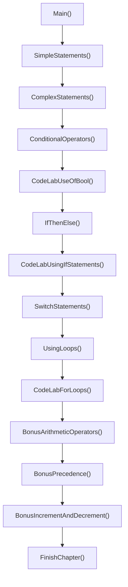
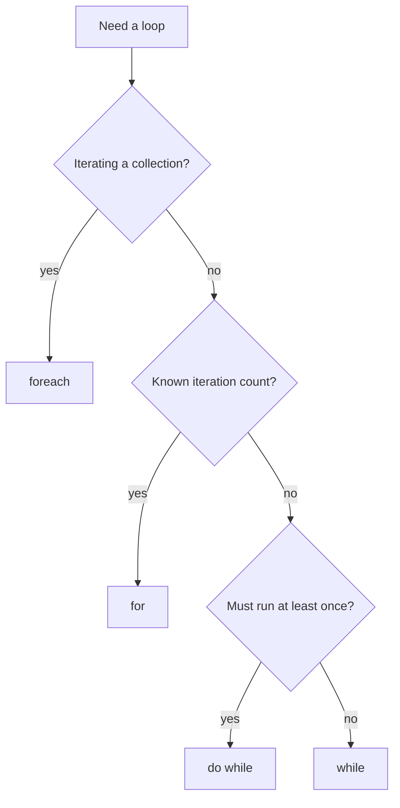

# Chapter 2: Basic Program Structure

## What This Chapter Teaches

Program flow. That is the whole subject.

Every programming language ever invented needs three things: a way to say "do this, then do that," a way to say "do this only if," and a way to say "do this repeatedly." Chapter 2 covers C#'s version of all three, plus the operators you need in order to write the conditions those structures depend on.

It is the longest chapter so far and one of the most important, because essentially nothing after this point works without it. Chapter 1 taught you how to get a program to start. This one teaches you how to get it to do anything interesting once it has.

By the end you should be comfortable with:

- Statements, blocks, and the difference between a statement and an expression
- Relational, logical, and bitwise operators
- The ternary conditional operator
- `if` / `else if` / `else`
- `switch`, including stacked cases and the no-fall-through rule
- `for`, `foreach`, `while`, and `do while`
- Arithmetic and compound assignment operators
- Operator precedence, and why parentheses are cheaper than debugging
- Increment and decrement, prefix versus postfix

> **See also:** `LectureNotes.md` in this project goes deeper on operators, truth tables, and short-circuit evaluation. This document covers the program's structure and walks the lessons in the order they execute. They are meant to be read together.

---

## The Standard Lesson Shape

Open `Program.cs` and the first thing to notice is that it looks almost exactly like Chapter 1, only much bigger. That is deliberate. Every full lesson project in this solution follows the same skeleton, so once you learn it here you never have to relearn it.

```csharp
internal static class Program
{
    #region Constants
    private const string CodeSamples = @"Textbook Resources.zip\MCSD Certification Code and Test Questions\02\Chapter2\";
    private const string CheatSheet = @"Textbook Resources.zip\MCSD Certification Toolkit Cheat Sheets & Key Terms\";
    private const int Chapter = 2;
    private const string Topic = "program flow";
    #endregion

    #region Main Executable Method
    // Note: We have removed the "args" array since we are not passing command-line arguments
    private static void Main()
    {
        try
        {
            // Lesson 1: Understanding Simple Statements
            SimpleStatements();
            GenericFunctions.Pause();

            // Lesson 2: Understanding Complex Statements
            ComplexStatements();
            GenericFunctions.Pause();

            // ...and so on through the chapter

            GenericFunctions.FinishChapter(CodeSamples, CheatSheet, Chapter, Topic);
        }
        catch (Exception ex)
        {
            new DatabankException("Error Caught!", ex).Log();
            GenericFunctions.Pause();
        }
        finally
        {
            GenericFunctions.Pause(final: true);
        }
    }
    #endregion
}
```

Four things are worth calling out before we get to the actual content.

**`Main()` has no `args` parameter.** Chapter 1 declared `Main(string[] args)` and used it to demonstrate an index-out-of-range crash. This chapter takes no command-line arguments, so the parameter is gone. C# lets `Main` be declared with or without it and the runtime uses whichever you wrote. Do not carry a parameter you never read.

**`Main` is a table of contents.** Each lesson is one method call followed by one `GenericFunctions.Pause()`. Read `Main` top to bottom and you have read the chapter outline. This is the payoff of the code standard noted right in the source:

```csharp
// Code Standards Hint: Method-names should be self-commenting. That is, the method name should explain
// what the method does. Because of this, each method should only perform one main task.
```

`SwitchStatements()` switches. `UsingLoops()` loops. If you cannot name a method without using the word "and," it is probably doing two things.

**The try/catch/finally is the house pattern.** Same as Chapter 1 and every lesson after this. `DatabankException` wraps and logs, `Pause(final: true)` holds the window open at the end. The source is honest about getting ahead of itself:

```csharp
// Note: I am using a try/catch/finally structure here, because this is our standard pattern
//       However, we will save a discussion of this until the appropriate chapter
```

That is a good thing to write in teaching code. The pattern is there because it is needed, and the explanation is deferred to Chapter 6 where it belongs.

**The lessons are split into two banks with a note block between them.** Lessons 1 through 3 plus two code labs run first, then Lessons 4 through 6 and the rest. Between them sit long comment regions of reference material. The comments are content, not clutter.



---

## Pre-Lesson: Comments

Before any lesson runs, `Main` opens with a region that teaches by being the thing it describes:

```csharp
#region Pre-Lesson: Understanding Comments
// A single-line comment is preceded by two forward-slashes (//)

/*
 * A multi-line comment is preceded by a forward-slash and an asterisk
 * Note: A common convention is to precede internal lines with an asterisk,
 *       but this is not required.
 * The multi-line comment is closed when it is followed by an asterisk and a forward-slash
 */
#endregion
```

The leading asterisks on continuation lines are pure convention. The compiler ignores everything between `/*` and `*/` regardless. The convention is still worth following, because it makes a comment block visually obvious when you are scrolling fast.

You will also see `#region` and `#endregion` used heavily in this file. Those are preprocessor directives that let the editor collapse sections, and they have zero effect on compiled output. In a 1200-line teaching file they are a navigation aid. In a 1200-line production file they are usually a sign that the class needs to be split into several.

---

## Lesson 1: Simple Statements

A **statement** is a code construct that instructs the computer to do something. A **simple statement** ends with a semicolon and typically performs a single action.

```csharp
// Variable Declaration Statements (Declare variable names)
int counter;
float distance;
string firstName;
// Note: In a real-world program, we would declare these with the initialization

// Assignment Statements (Assign values to variables)
counter = 0;
distance = 4.5f;
firstName = "Bill";

// You can combine declaration and assignment in a single simple statement
const string instructorName = "Alex Turner";
```

That source comment is correct. Splitting declaration from assignment is done here only so both categories are visible. In real code you write `int counter = 0;` and move on. Declaring without initializing sets you up for a "use of unassigned local variable" compile error the moment some path reads it before writing it.

The `4.5f` suffix is not decoration either. An undecorated `4.5` is a `double` literal, and C# will not silently narrow a `double` into a `float`. The `f` says "treat this literal as a float."

`const` gets a quiet introduction here. A `const` value is baked in at compile time and can never be reassigned. It is not the same thing as `readonly`, which is set at construction time and is a Chapter 3 topic.

### Jump Statements

```csharp
// Jump Statements (Used to direct code flow)
// Note: I have commented these out, as they cannot be used in their current location
//break;
//continue;
//return;
```

Three jump statements introduced by name and immediately commented out, because none of them is legal here. `break` and `continue` need a loop or a `switch` to jump out of. `return` would be legal in a `void` method but would end the lesson early, which would defeat the point.

Naming them now and demonstrating them later, in the contexts where they make sense, is the right teaching order.

### The Empty Statement

```csharp
// Empty Statement (A stand-alone semicolon on a line by itself is legal in code but does nothing)
;
```

A bare `;` is a legal statement that does nothing at all. You will never write one deliberately. You may well write one accidentally:

```csharp
if (x == 5); // this semicolon ends the if statement right here
{
    // this block always runs, regardless of x
}
```

The `if` governs the empty statement. The block that follows is just an unconditional block that happens to be indented suggestively. The compiler will not warn you. Burn this into memory now, because it is one character and it produces a bug that looks impossible when you are staring straight at it.

---

## Lesson 2: Complex Statements

```csharp
/*
 * Block (Definition)
 * A block is a section of code contained within a pair of curly braces {}      NOSONAR
 */

/*
 * Complex Statement (Definition)
 * A complex statement will enclose multiple simple statements within a block
 * Note: Complex statements may end with a semicolon (e.g. do {} while (); block),
 *       but this is not a requirement for most.
 */
```

A **block** is statements wrapped in braces. A block used as the body of a control structure gives you a **complex statement**.

```csharp
// Could also be expressed as: `int[] numbers = [5, 24, 36, 19, 45, 60, 78];`
int[] numbers = { 5, 24, 36, 19, 45, 60, 78 };
int evenNums = 0;

// Loop example (foreach)
// Don't worry about the operators for now. Just note the blocks that make this a complex statement
foreach (int num in numbers)
{
    Console.WriteLine($"num = {num}");
    if (num % 2 == 0)
    {
        evenNums++;
    }
}

Console.WriteLine($"Found {evenNums} even number{(evenNums == 1 ? "" : "s")}");
```

The `foreach` containing an `if` is a complex statement built from two nested blocks. That is the whole demonstration.

Three details in passing, all of which get their own treatment later.

**The array uses the classic brace initializer**, deliberately, with the modern equivalent noted in a comment right above it:

```csharp
int[] numbers = [5, 24, 36, 19, 45, 60, 78];
```

Same array, same values. The brace form is not deprecated and compiles fine. You will see both styles across this codebase, braces where a lesson is preserving the older look on purpose and brackets everywhere else. Learn to read both, because plenty of code you inherit predates the bracket syntax. `IDE0300` is the analyzer rule suggesting the newer form, suppressed here for exactly that reason.

**`num % 2 == 0`** is the standard even-number test. The modulus operator returns the remainder, and a remainder of zero after dividing by two means the number is even. Modulus gets its proper introduction in the bonus lessons.

**`{(evenNums == 1 ? "" : "s")}`** is a ternary operator inside a string interpolation, producing "1 even number" or "3 even numbers" with correct grammar. Small, but it is the difference between output that looks finished and output that looks like a prototype. The ternary is Lesson 3's topic and it has already snuck in here.

---

## Lesson 3: Conditional Operators

This is the operator tour, and it is the densest lesson in the chapter.

```csharp
/*
 * Boolean (true/false) variables and values are used in logical (comparison) operations
 * The result of a conditional is always a Boolean value
 */

const bool myConditionResult = false;
```

### Relational Operators

```
 * Operator |        Meaning        |    Example     |        Returns true When
 *    <     | Less Than             | expr1 < expr2  | expr1 is less than expr2
 *    >     | Greater Than          | expr1 > expr2  | expr1 is greater than expr2
 *    <=    | Less than or Equal    | expr1 <= expr2 | expr1 is less than or equal to expr2
 *    >=    | Greater than or Equal | expr1 >= expr2 | expr1 is greater than or equal to expr2
 *    ==    | Equality              | expr1 == expr2 | expr1 is equal to expr2
 *    !=    | Inequality            | expr1 != expr2 | expr1 is not equal to expr2
```

All six always return a `bool`. The lesson runs every one of them against two `byte` values and prints the results:

```csharp
byte expr1 = 1;
byte expr2 = 2;
Console.WriteLine($"expr1 < expr2 ? {expr1 < expr2}");
Console.WriteLine($"expr1 > expr2 ? {expr1 > expr2}");
// ...and so on for <=, >=, ==, !=
```

Nothing surprising, which is exactly why the next part lands so hard.

### The Gotcha: Assignment Masquerading as Comparison

```csharp
/*
 * GOTCHA WARNING!
 *
 * Be careful not to use the assignment operator when you mean to use the equality operator.
 * The assignment operator will always be evaluated as true if it returns a non-zero, non-null,
 *     and you'll change the value in your variable.
 *
 * This is a very common logic error and can be difficult to find in a complex program,
 *     so be careful!
 */
Console.WriteLine($"expr1 == expr2 ? {expr1 == expr2}");
Console.WriteLine($"expr1 = expr2 ? {expr1 = expr2}");
Console.WriteLine($"expr1 = {expr1}");
```

The second line uses one equals sign. It compiles, because `expr1 = expr2` is an *expression* that evaluates to the assigned value, not merely a statement. So it prints something plausible, and it also just silently overwrote `expr1`. The `WriteLine` that follows exists purely to prove the damage, printing the new value of `expr1`.

This is why the statement-versus-expression distinction earns space at the top of the lecture notes. If assignment did not evaluate to a value, typing `=` where you meant `==` would simply fail to compile. Instead it compiles and quietly changes your data.

C# does protect you in the most common case. Inside an `if` condition the expression must be `bool`, so `if (x = 5)` fails to compile because `5` is an `int`. But `if (someBool = true)` compiles perfectly and is true forever. Guess which one shows up in production.

S1121 is the analyzer rule for "assignments should not be made from within sub-expressions," which is a genuinely good rule and the entire lesson here. Suppressed narrowly, restored immediately.

### Bitwise Operators

```csharp
Console.WriteLine($"expr1 & expr2 = {Convert.ToString(expr1 & expr2, 2).PadLeft(8, '0')} = {expr1 & expr2}");
// expr1 & expr2 = Binary 00001010 = 10
Console.WriteLine($"expr1 | expr2 = {Convert.ToString(expr1 | expr2, 2).PadLeft(8, '0')} = {expr1 | expr2}");
// expr1 | expr2 = Binary 00001111 = 15
Console.WriteLine($"expr1 ^ expr2 = {Convert.ToString(expr1 ^ expr2, 2).PadLeft(8, '0')} = {expr1 ^ expr2}");
// expr1 ^ expr2 = Binary 00000101 =  5
```

`&`, `|`, and `^` compare integers bit by bit and return an integer. On `bool` operands they behave like their logical cousins `&&` and `||` minus the short-circuiting.

That distinction matters more than it looks. `&&` skips evaluating its right side if the left side is already false, which is the mechanism behind the most common null guard in C#:

```csharp
if (obj != null && obj.SomeProperty == 5)
```

If `obj` is null, `obj.SomeProperty` is never touched. Swap `&&` for `&` and that protection vanishes, because `&` always evaluates both operands.

The `Convert.ToString(value, 2).PadLeft(8, '0')` idiom is worth stealing. It is the standard way to print a number in binary in .NET Framework, and `PadLeft` restores the leading zeros that `ToString` drops.

### The Bitwise Complement Trap

```csharp
/*
 * GOTCHA WARNING!
 * The bitwise ~ operator returns a signed 32-bit integer by default, regardless of the data type being
 * complemented, so be sure to cast the result where necessary to get the expected results.
 */

// Note: Bitwise complements will include the leading zero bits complemented to 1's
Console.WriteLine($"~expr1 = {Convert.ToString((byte)~expr1, 2).PadLeft(8, '0')} = {(byte)~expr1}");
// ~expr1 = Binary 11110000 = 240
```

Apply `~` to a `byte` and you do not get a `byte` back. C# promotes the operand to a signed 32-bit `int`, complements all 32 bits, and hands you a possibly negative number nowhere near what you expected. The `(byte)` cast is load-bearing, not cosmetic. Remove it and the output changes completely.

### The Ternary Conditional Operator

```csharp
/*
 * The Ternary Conditional Operator
 * C# offers a number of abbreviated methods for expressing complex but common operations.
 * The conditional operator allows you to evaluate a condition and return different values when it is true or false.
 *
 * The syntax is condition ? valueIfTrue : valueIfFalse
 */

string result = expr1 > expr2 ? "" : "not ";
```

Read it as: condition, `?`, value when true, `:`, value when false. The source shows the six-line `if`/`else` it replaces, commented out for direct comparison:

```csharp
//if (expr1 > expr2)
//{
//    result = "";
//}
//else
//{
//    result = "not ";
//}
```

Then the payoff:

```csharp
Console.WriteLine($"{expr1} is {result}greater than {expr2}");
```

One sentence template, two possible readings, no duplicated string. This is the ternary's best use case: choosing between two values, not choosing between two branches of logic. If the two arms start containing real work, go back to `if`/`else`.

---

## Lesson 4: If Then Else

The three shapes, in increasing order of ambition, all documented in a syntax comment before any of them runs.

```csharp
int x = 1;
int y = 2;
```

One line here is doing quiet subversion:

```csharp
// NOTE: The book recommends always surrounding the statement governed by an "if" with curly braces
//       However, if there is only one simple statement to execute, these are not strictly required
if (true) Console.WriteLine("This statement still executes.");

// Through the remainder of this lesson, we'll stick to the book standards.
```

Braces are optional for a single statement. Use them anyway. The reason is not aesthetic. Braceless `if` statements are where bugs hide: someone adds a second line underneath, indents it to match, and it runs unconditionally forever. Apple shipped a TLS vulnerability from exactly this shape of mistake.

The lesson demonstrates the shortcut once, then commits to the safer standard. That is the correct way to teach an option you do not want people using.

The remaining three examples reassign `x` between each one so all three branches actually fire as you watch:

```csharp
if (x < y)
{
    Console.WriteLine($"{x} is less than {y}");
}

x = 3;

if (x > y)
{
    Console.WriteLine($"{x} is greater than {y}");
}
else
{
    Console.WriteLine($"{x} is not greater than {y}");
}

x = 2;

if (x < y)
{
    Console.WriteLine($"{x} is less than {y}");
}
else if (x > y)
{
    Console.WriteLine($"{x} is greater than {y}");
}
else
{
    Console.WriteLine($"{x} is equal to {y}");
}
```

Note that `else if` is not a keyword. It is an `else` whose single statement happens to be another `if`. That is why you can chain as many as you like, and why the final `else` binds to the last `if` in the chain rather than the first.

---

## Lesson 5: Switch Statements

When you are comparing one variable against many possible values, a chain of `else if` gets unwieldy fast. `switch` is built for that job.

```
 * When comparing possible values of a single variable, the if, else if ... else construct
 *     can become unwieldy. A better control structure for this scenario is the 'switch'
 *
 * Switch can compare values for any simple data type (string, int, double, etc.)
 *
 * Don't use this structure if your decision branching is based on multiple variables
 * Don't use this structure to compare complex data types
```

Memorize those two prohibitions. Multiple variables means `if`/`else if`. Complex types means `if`/`else if` as well, or pattern matching in modern C#.

### Switching on a String

```csharp
string condition = "Hello";
Console.WriteLine($"condition = {condition}");

switch (condition)
{
    case "Good Morning":
        Console.WriteLine("Good morning to you!");
        break;
    case "Hello":
        Console.WriteLine("Hello to you too.");
        break;
    case "Good Evening":
        Console.WriteLine("Have a wonderful evening!");
        break;
    default:
        Console.WriteLine("Good bye...");
        break;
}
```

C# allows `switch` on strings, which C and C++ do not. It is genuinely useful and it is also a common source of bugs, because string comparison here is ordinal and case-sensitive. `"hello"` would fall through to `default`.

### Stacked Cases

```csharp
var r = new Random();
int number = r.Next(0, 9);
Console.WriteLine();
switch (number)
{
    case 0:
    case 1:
        Console.WriteLine($"Number [{number}] could be binary, octal, or decimal.");
        break;
    case 2:
    case 3:
    case 4:
    case 5:
    case 6:
    case 7:
        Console.WriteLine($"Number [{number}] could be octal or decimal.");
        break;
    default:
        Console.WriteLine($"Number [{number}] must be decimal.");
        break;
}
```

A nice example, because the grouping is not arbitrary. Digits 0 and 1 are valid in base 2, base 8, and base 10. Digits 2 through 7 are valid in base 8 and base 10. Digits 8 and 9 only in base 10. The `switch` structure mirrors an actual fact about number systems.

### The Fall-Through Rule

C# is stricter than C and C++ here, on purpose. Every non-empty `case` must end with a jump statement, normally `break`, sometimes `return` or `goto case`. Forget it and you get a compile error, not a silent bug.

Empty cases *can* stack, which is exactly what makes the example above legal. `case 0:` contains no statements at all, so it falls into `case 1:`. Put a single line under `case 0:` and it immediately needs its own `break`.

The source also flags a pattern you will use constantly:

```
 * The 'switch' structure can be especially useful when using the 'return' jump instead of 'break'
```

A `switch` where every case returns a value is the standard shape for a lookup method: input value in, mapped value out, `default` handling the unmatched case. No temporary variable, no accidental fall-through, and the compiler will tell you if you forgot a path.

`default` is optional. Leave it out and an unmatched value skips the whole `switch` silently. Include it whenever "none of the above" means something, which is more often than people expect.

---

## Lesson 6: Using Loops

Four loop constructs, each with a shape it fits best. This lesson is also structured differently from the others: it runs the lottery and average-grades code labs inline, in the middle of itself, right after teaching the loop each one depends on.

### `for`

```
 * 'for' Loop
 *
 * When you want to execute instructions a specified number of times, use a 'for' loop
 *
 * Syntax:
 *   for (initial_state, condition, iterator)
 *   {
 *       instructions_to_repeat;
 *   }
```

```csharp
// This loop continues to run as long as the condition (i <= 10) remains true
for (int i = 1; i <= 10; i++)
{
    Console.WriteLine($"i = {i}");
}
```

Three parts separated by semicolons. The initializer runs once, the condition is checked before every iteration including the first, and the iterator runs after each pass through the body. The loop variable `i` is scoped to the loop and does not exist after it.

Note this one starts at 1 and uses `<=`, printing 1 through 10. The more common idiom starts at 0 and uses `<`. Both give ten iterations. Mixing them up is where off-by-one errors are born.

### The Infinite Loop Warning

```
 * GOTCHA WARNING!
 *
 * In all loops, make sure you have properly coded an exit point. That is, you need to have a condition
 *     that, when met, ends the loop, and there needs to be some function that will eventually cause
 *     that condition to occur. Otherwise, you'll have what's called an "infinite loop."
 *
 *   // Because this iterates down (-1, -2, etc.), i will *always* be less than 10, and the loop never ends
 *   for (int i = 0; i <= 10; i--)
 *   {
 *       Console.WriteLine(i);
 *   }
```

Two requirements, and people usually only remember the first. You need a condition that *can* become false, and you need an iterator that actually moves toward making it false. This example has a perfectly good condition and an iterator running the wrong direction. It compiles without a single warning.

Technically it is not infinite. `i` will eventually underflow past `int.MinValue` and wrap around to a positive number, at which point the loop exits. That takes about four billion iterations, so calling it infinite is close enough for practical purposes and considerably more honest than calling it "eventually terminating."

Then the lesson runs the lottery lab, which is a `for` loop exercise:

```csharp
Console.WriteLine("Press any key to run the lottery code lab...");
Console.ReadKey();
CodeLabLotteryProgram();
GenericFunctions.Pause();
```

### `foreach`

```
 * 'foreach' Loop
 *
 * When you have a collection of items, and you want to perform a series of instructions on every item
 *     in the collection, use a 'foreach' loop.
 *
 * Syntax:
 *   foreach(variable in collection)
 *   {
 *       instructions_to_repeat;
 *   }
```

```csharp
int[] numbers = [5, 10, 15, 20];
foreach (int number in numbers)
{
    Console.WriteLine($"number / 5 = {number / 5}");
}
```

No index, no bounds check, no chance of an off-by-one error. `foreach` asks the collection for an enumerator and keeps going until the enumerator says stop, which is why it does not need to know the size in advance.

The tradeoff: the iteration variable is read-only, so you cannot use `foreach` to modify elements in place. Modifying the collection itself during a `foreach` throws `InvalidOperationException`. If you need to change things, use `for` with an index, or build a new collection.

Then the grades lab runs, which is the `foreach` exercise:

```csharp
Console.WriteLine("Press any key to run the grades code lab...");
Console.ReadKey();
CodeLabAverageGrades();
GenericFunctions.Pause();
```

### `while` and `do while`

```
 * When you need to loop until a condition occurs, but you are not controlling the condition outside the loop,
 *     a 'while' or 'do while' loop is your best choice.
 *
 * These two types of loops are very similar, but there is one main difference:
 * - A 'while' loop compares the condition before it executes, but a 'do while' loop compares
 *       the condition after executing.
 * - This means that even if the condition is already false, a 'do while' loop will execute at least once
```

```csharp
int num = 0;
var r = new Random();
while (num != 10)
{
    num = r.Next(0, 11);
    Console.WriteLine($"num = {num}");
}
```

Two details in four lines. `r.Next(0, 11)` uses an exclusive upper bound, producing 0 through 10, which is what makes reaching 10 possible at all. Write `Next(0, 10)` and this loop genuinely never terminates. And the number of iterations is unknowable in advance, which is the entire justification for choosing `while` over `for`.

```csharp
do
{
    Console.WriteLine("Note: Even though I made the condition false, this loop ran once.");
} while (false);
```

About as direct a demonstration as you could ask for. The condition is a literal `false` and the body still runs. Reach for `do while` when the first pass has to happen regardless, such as prompting a user before you can possibly validate their answer.

Note the semicolon after `while (false)`. It is required, and this is the only place in C# where a `while` keyword is followed by one.



---

## The Code Labs

Five short exercises from the textbook, each isolating one idea. All of them also exist as standalone runnable projects.

### Use of Bool

```csharp
// create a variable of type bool called result
// Note: Unlike fields, local variables have no default value in C# - the compiler
//       requires "result" to be definitely assigned before it's read, which is why
//       it must be set below before Console.WriteLine can use it
bool result;

result = 2 == 2;

Console.WriteLine($"result = {result}");
```

The point is that a comparison *is* a value. `2 == 2` is not something that only works inside an `if`. It is an expression producing `true`, and `true` can be stored in a variable like anything else.

That comment about locals is worth reading twice. Class fields get zeroed automatically. Local variables do not. This is *definite assignment analysis*, and it is one of the better things C# does for you, because the alternative is reading whatever garbage was previously on the stack.

S1764 flags identical expressions on both sides of an operator, which is normally a copy-paste bug detector and here is the literal lesson.

### Using If Statements

Single `if`, compound condition with `&&`, and nested `if`. The nesting case shows something people forget:

```csharp
if (first == 2)
{
    if (second == 0)
    {
        Console.WriteLine("Both outer and inner conditions are true.");
    }
    Console.WriteLine("Outer condition is true, inner may be true.");
}
```

That second `WriteLine` belongs to the **outer** `if`. It runs when `first == 2`, regardless of `second`. A flattened `if (first == 2 && second == 0)` cannot express that. Nesting exists precisely so you have somewhere to put work that depends on the outer condition alone. If you have nothing to put there, flatten it.

### Lottery Program

```csharp
// used to set up a range of values to choose from
int[] range = new int[49];

// used to simulate lottery numbers chosen
int[] picked = new int[6];

// set up a random number generator
Random rnd = new();

// populate the range with values from 1 to 49
for (int i = 0; i < 49; i++)
{
    range[i] = i + 1;
}

// pick 6 random numbers
for (int select = 0; select < 6; select++)
{
    picked[select] = range[rnd.Next(49)];
}
```

`new int[49]` gives you 49 zeros, not 49 empty slots. Array elements of a value type are zero-initialized at creation. This is one of the places C# does hand you a default, unlike local variables.

The `+ 1` is why the fill loop exists at all. Array indices run 0 to 48, lottery numbers run 1 to 49, and `range[i] = i + 1` maps between them.

`Random rnd = new();` is a target-typed `new` expression. The compiler infers `Random` from the declaration on the left, so you do not repeat the type name.

`rnd.Next(49)` with one argument returns 0 through 48, exclusive of the upper bound, which is correct here because it is being used as an array index. The two-argument overload is also exclusive on the upper bound, which trips people up constantly.

**A bug that is still there:** nothing removes a drawn number from `range`, so this can pick the same number twice. Real lottery draws are without replacement. Fixing it is a genuinely worthwhile exercise, and the standard approaches are swap-and-shrink or a full Fisher-Yates shuffle.

### Average Grades

```csharp
int[] arrGrades = [78, 89, 90, 76, 98, 65];

int total = 0;
int gradeCount = 0;
double average;

foreach (int grade in arrGrades)
{
    // Equivalent to total = total + grade;         NOSONAR
    total += grade;   // add each grade value to total
    gradeCount++;     // increment counter for use in average
}

if (gradeCount == 0) total = gradeCount = 1;

average = (double)total / gradeCount;   // calculate average of grades
Console.WriteLine($"Average grade = {average}");
```

The accumulator pattern: one variable collecting a running total, one counting iterations, both initialized before the loop because you cannot add to something that does not exist yet.

**The cast placement is everything.** `(double)total / gradeCount` casts `total` first, making the division a `double`-by-`int` operation, which C# resolves by promoting `gradeCount` too. Floating-point division, correct answer.

Contrast with `(double)(total / gradeCount)`. Those parentheses do the integer division first and then widen the already-truncated result. Same characters, same types, completely different answer. 496 divided by 6 gives you 82 instead of 82.666. This is the single most common arithmetic bug in C#, and the original textbook version of this lab shipped with it.

You only need **one** operand to be floating point. The other gets promoted automatically.

**The divide-by-zero guard** is a habit worth building:

```csharp
if (gradeCount == 0) total = gradeCount = 1;
```

That chained assignment sets both to 1. Note that integer division by zero throws `DivideByZeroException` while floating-point division by zero quietly returns `Infinity` or `NaN`. Neither is what you want.

`gradeCount` is arguably redundant here since `arrGrades.Length` gives the same number without a loop. It is written longhand because the pattern generalizes: when iterating something with no `Length`, such as a stream or a data reader, counting as you go is the only option.

### Working with For Loops

A catalog of loop shapes, best read as a reference table:

```csharp
for (int i = 0; i < 10; i++)      // 0 through 9, ten iterations
for (int i = 10; i > 0; i--)      // 10 down to 1, ten iterations
for (int i = 0; i < 10; i += 2)   // 0, 2, 4, 6, 8, five iterations
for (int i = 5; i < 1000; i *= 5) // 5, 25, 125, 625, four iterations
```

The counting-up and counting-down loops are mirror images with an asymmetry worth noticing: the first excludes its bound, the second includes its start and excludes zero. Off-by-one errors live in exactly that asymmetry.

The last two make a point the syntax comment does not: **the iterator is arbitrary code**. It can add, multiply, or do anything else. The compiler does not verify that it makes progress toward the exit condition. Change that multiply loop's initializer to `int i = 0` and `i *= 5` leaves `i` at zero forever.

The lab then does the same counting task with `foreach` over an `int[]`, `foreach` over a `string[]`, a `while`, and a `do while`, all producing similar output. Showing four constructs solving one problem is the fastest way to see what actually differs between them, which is mostly bookkeeping and scope rather than capability.

---

## The Bonus Lessons

Three extras beyond the textbook's coverage.

### Arithmetic Operators

```csharp
// Assignment (=)
int a = 4;
int b = 2;

// Unary Plus (+) : Positive
int c = +1;

// Unary Minus (-) : Negative
int d = -1;

// Addition (+), Subtraction (-), Multiplication (*), Division (/)
c = a + b;
c = a - b;
c = a * b;
c = a / b;
```

The unary `+` is a real operator and it does nothing. `+1` is just `1`. It exists for symmetry with unary minus and because operator overloading allows a type to define it. You will essentially never write it.

Integer division truncating toward zero is the thing to remember. `a / b` here is `4 / 2`, which is cleanly `2`. Try `5 / 2` and you get `2`, not `2.5` and not `3`. No rounding, just truncation.

### Compound Assignment

```csharp
c = 5;

// Addition/Assignment (+=)
Console.Write($"{c} += 5 yields ");
c += 5;
Console.WriteLine(c);

// Subtraction/Assignment (-=), Multiplication/Assignment (*=), Division/Assignment (/=)
c -= 5;
c *= 2;
c /= 2;
```

`c += 5` is shorthand for `c = c + 5`. Every arithmetic operator has a compound form, and so do the bitwise ones (`&=`, `|=`, `^=`, `<<=`, `>>=`).

Note the `Console.Write` before each operation and `Console.WriteLine` after. `Write` does not append a newline, so the before-value and after-value land on the same line. Small formatting trick, genuinely useful.

There is a subtlety worth knowing: compound assignment includes an implicit cast. `byte b = 10; b += 300;` compiles, wraps around, and produces nonsense, while `b = b + 300;` fails to compile because the result is an `int`. The shorthand is not purely cosmetic.

### Modulus

```csharp
// Modulus (%) - Returns the remainder when dividing the values to either side
d = c % b;
Console.WriteLine($"{c} % {b} = {d}");
```

The remainder operator, and the standard tool for "is this even," "every nth iteration," and wrapping a value into a range. You already used it in Lesson 2 for the even-number test.

Careful with negative operands. In C#, `-7 % 3` is `-1`, not `2`. The result takes the sign of the dividend. If you need a mathematically positive modulus you have to adjust for it yourself.

### Precedence

```csharp
// Aside from the assignment operator, other arithmetic operators process left-to-right
// However, they also obey an order of precedence

// First, multiplication and division are processed (still left-to-right)
//   and then addition and subtraction are processed

// Here the multiplication processes first, so this is equivalent to 2 + 4 = 6
Console.WriteLine($"2 + 2 * 2 = {2 + 2 * 2}");
```

Close enough to ordinary math that most people never think about it until it bites them. Multiplication and division before addition and subtraction, comparisons before `&&`, `&&` before `||`, assignment last and right-to-left.

The practical takeaway is not to memorize the full precedence table. It is to use parentheses whenever a reader might have to stop and think. Parentheses cost nothing at runtime and are considerably cheaper than a debugging session.

Assignment being right-associative is what makes `total = gradeCount = 1` work in the grades lab. The rightmost assignment happens first and its value feeds leftward.

### Increment and Decrement

```csharp
int a = 5;
int b = a++;  // b is 5, a is 6   (use, then increment)

int c = 5;
int d = ++c;  // d is 6, c is 6   (increment, then use)
```

Both forms change the variable identically. The difference is only in what the *expression* evaluates to. Postfix hands back the old value and then increments. Prefix increments and then hands back the new value.

As a standalone statement, `i++` and `++i` are interchangeable, which is why the distinction seems academic right up until someone writes `array[i++]` and you have to work out which element got touched.

The advice: use them as standalone statements. If you find yourself embedding one inside a larger expression, split it into two lines instead. You will not be less clever, you will just be readable.

---

## Key Takeaways

- **`Main` should read like a table of contents.** One call per lesson, self-commenting method names, one job per method.
- **Statements do things, expressions produce values.** Assignment is both, and that is exactly what makes `=` versus `==` dangerous.
- **Always use braces on `if` bodies.** The single-statement shortcut exists and is not worth the risk.
- **A stray semicolon after an `if` condition compiles silently.** Know what an empty statement looks like.
- **`&&` short-circuits, `&` does not.** This is what makes `obj != null && obj.Prop == x` safe.
- **`switch` requires an explicit jump per non-empty case.** C# does not allow accidental fall-through, but empty cases can still stack.
- **Pick the loop that matches the problem.** Counted iterations get `for`, collections get `foreach`, unknown counts get `while`, guaranteed-first-pass gets `do while`.
- **An infinite loop needs two failures.** A condition that can become false, and an iterator that moves toward it. Check both.
- **Integer division truncates.** Declaring the result as `double` does not help if both operands are `int`. Cast before dividing, not after.
- **Locals have no default value.** The compiler enforces definite assignment, unlike fields.
- **`~` promotes to `int` before complementing.** Cast back down or get surprised.
- **Parentheses are free.** Use them wherever precedence is not instantly obvious.
- **Suppress analyzer rules narrowly and explain why.** `#pragma warning disable` with a reason and a matching `restore` is fine. A blanket suppression is not.

---

## Suggested Exercises

1. **Reproduce the semicolon bug.** Write `if (false); { Console.WriteLine("gotcha"); }` and run it. Then explain to somebody else why it printed.
2. **Break the average.** Move the cast to `(double)(total / gradeCount)` and confirm you get 82.00, which is worse than 82 because now it looks precise while being wrong.
3. **Make the `while` loop hang.** Change `r.Next(0, 11)` to `r.Next(0, 10)` and understand why it never finishes.
4. **Fix the lottery duplicates.** Make the draw happen without replacement, then look up Fisher-Yates and compare your approach.
5. **Convert the stacked `switch` to `if`/`else if`.** Count the lines. Decide which you would rather maintain.
6. **Prove compound assignment casts.** Try `byte b = 10; b += 300;` next to `byte b = 10; b = b + 300;` and explain why only one compiles.

---

## Related Projects

The textbook labs from this chapter also exist as standalone runnable projects under `CSharp.Ch02.TextbookCode.*`, covering `if` statements, the lottery program, average grades, and `for` loops. Run any of them from `LessonRunner` under the Chapter 2 menu.

Also see `LectureNotes.md` in this project for the full operator reference, truth tables, and a deeper treatment of short-circuit evaluation.