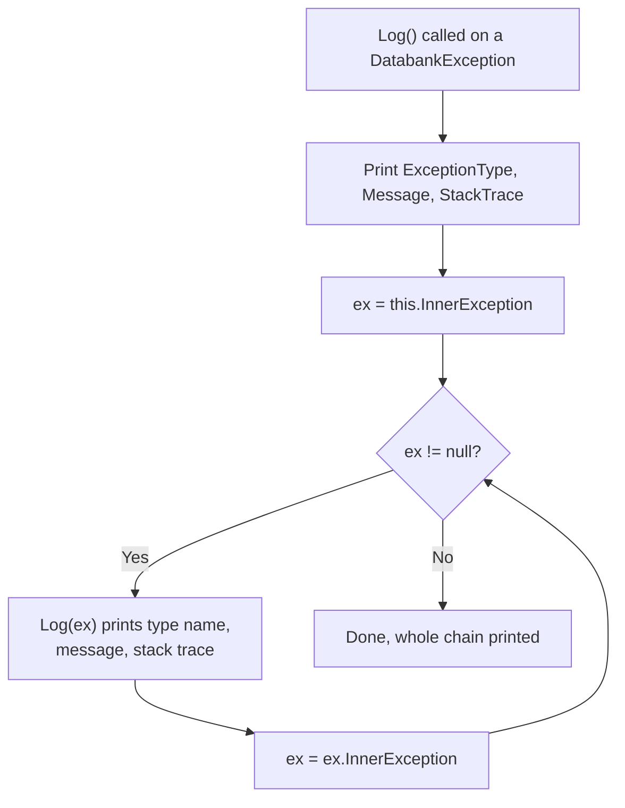
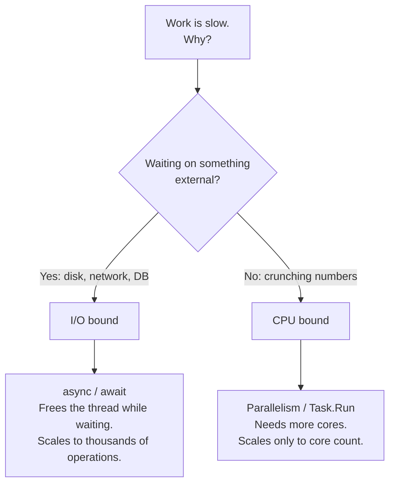
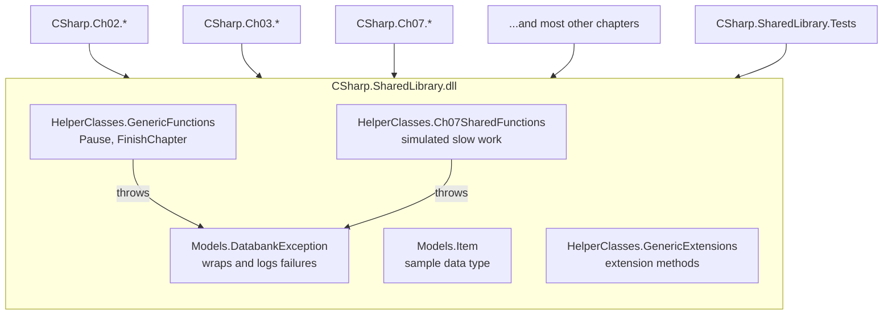

# CSharp.SharedLibrary

> **Project:** `CSharp.SharedLibrary`
> **Type:** Class library (`Library`)
> **Target Framework:** `net48` (inherited from `Directory.Build.props`)
> **Prerequisites:** `CSharp.Ch01.HelloWorld`
> **Tested by:** `CSharp.SharedLibrary.Tests`

---

## Table of Contents

1. [What You'll Learn](#what-youll-learn)
2. [The Point of a Shared Library](#the-point-of-a-shared-library)
3. [Library vs. Exe](#library-vs-exe)
4. [Project Layout](#project-layout)
5. [`DatabankException`: A Custom Exception Type](#databankexception-a-custom-exception-type)
6. [`Item`: Deliberately Boring](#item-deliberately-boring)
7. [`GenericFunctions`: The Bookends](#genericfunctions-the-bookends)
8. [`GenericExtensions`: Extension Methods, Explained](#genericextensions-extension-methods-explained)
9. [`Ch07SharedFunctions`: Fake Work That Takes Real Time](#ch07sharedfunctions-fake-work-that-takes-real-time)
10. [How the Pieces Connect](#how-the-pieces-connect)
11. [Sharp Edges Worth Knowing About](#sharp-edges-worth-knowing-about)
12. [The Tests](#the-tests)
13. [Exercises](#exercises)
14. [Key Terms](#key-terms)
15. [Where This Goes Next](#where-this-goes-next)

---

## What You'll Learn

By the end of this lesson you should be able to:

- Explain the difference between a class library and an executable, and when to reach for each
- Write a custom exception type that subclasses `Exception` correctly, including constructor chaining
- Explain why `: base(...)` matters and what breaks when you skip it
- Write and consume extension methods, and describe the rules the compiler uses to find them
- Explain the `TryParse` pattern and why it beats `Parse` wrapped in a `try` block
- Recognise generic methods, generic type constraints, and `ref` parameters
- Identify overload ambiguity and other design traps in otherwise reasonable-looking code

---

## The Point of a Shared Library

The `README.md` for this project opens with a useful disclaimer:

> Not a lesson. This is the toolbox every later chapter reaches into so nobody has to re-write the same exception wrapper or boolean parser for the fifteenth time.

That is true as far as it goes, but it undersells things slightly. This project is not a *chapter*, no, but it is very much a lesson, just an implicit one. Chapter 1 ended with a seven line loop that walked an exception chain, plus a comment admitting the same loop was about to be needed in every single program that followed. Writing that loop 150 times would be absurd. Writing it once, here, and calling it from 150 places is the entire idea behind a class library.

You will also find, once you start reading the code, that the author has used this project as a smuggling operation for teaching material. `GenericExtensions.cs` in particular is stuffed with block comments explaining extension method syntax as it goes, which is not something a genuinely internal utility library would bother with.

So: a toolbox, and also a worked example of how to build a toolbox.

---

## Library vs. Exe

Compare the two project files side by side. Chapter 1:

```xml
<PropertyGroup>
  <OutputType>Exe</OutputType>
  <RootNamespace>CSharp.Ch01.HelloWorld</RootNamespace>
  <AssemblyName>CSharp.Ch01.HelloWorld</AssemblyName>
</PropertyGroup>
```

This project:

```xml
<PropertyGroup>
  <OutputType>Library</OutputType>
  <RootNamespace>CSharp.SharedLibrary</RootNamespace>
  <AssemblyName>CSharp.SharedLibrary</AssemblyName>
</PropertyGroup>
```

One word differs, and it changes everything about how the output behaves.

| | `Exe` | `Library` |
|---|---|---|
| Produces | `.exe` | `.dll` |
| Needs a `Main` method | Yes, exactly one | No, and it would be ignored anyway |
| Can be run directly | Yes | No |
| Purpose | Does something | Provides something for others to do things with |

A `.dll` has no entry point and no console window of its own. It sits on disk doing nothing until some executable references it and calls into it. When `CSharp.Ch02.BasicProgramStructure` writes `GenericFunctions.Pause()`, the code that actually runs lives in `CSharp.SharedLibrary.dll`, executing on `CSharp.Ch02.BasicProgramStructure.exe`'s thread, in its process, writing to its console window.

To use it, a project adds a reference:

```xml
<ItemGroup>
  <ProjectReference Include="..\CSharp.SharedLibrary\CSharp.SharedLibrary.csproj" />
</ItemGroup>
```

That single line tells MSBuild two things: build `CSharp.SharedLibrary` first, and put its `.dll` somewhere the referencing project can find it at compile time and at runtime. This is why the `README.md` warns that "if a chapter references `CSharp.SharedLibrary`, that's your cue this project needs to build first." Break the library, and you break every chapter downstream of it simultaneously, which is the flip side of the bargain you make when you centralise code.

---

## Project Layout

```text
CSharp.SharedLibrary/
├── CSharp.SharedLibrary.csproj
├── README.md
├── Models/
│   ├── DatabankException.cs      Custom exception type with console logging
│   └── Item.cs                   A generic "some object" for examples
└── HelperClasses/
    ├── GenericExtensions.cs      Extension methods (the big one, 343 lines)
    ├── GenericFunctions.cs       Pause() and FinishChapter()
    └── Ch07SharedFunctions.cs    Simulated slow work for the async chapters
```

Two folders, two namespaces, and the split is meaningful rather than decorative:

- **`Models`** holds *things*: types you create instances of, that hold data.
- **`HelperClasses`** holds *actions*: static classes you never instantiate, that do work.

`namespace CSharp.SharedLibrary.Models` and `namespace CSharp.SharedLibrary.HelperClasses` match the folder names exactly. C# does not enforce this (you can put any namespace in any folder and the compiler will shrug), but every convention, tool, and colleague you will ever meet expects the two to line up. Visual Studio's "Add Class" will default to the folder based namespace, and static analysis will complain when they diverge.

---

## `DatabankException`: A Custom Exception Type

Here is the whole class, minus headers:

```csharp
namespace CSharp.SharedLibrary.Models
{
    /// <summary>
    /// Defines a custom exception class for reporting
    /// </summary>
    public class DatabankException : Exception
    {
        #region Properties
        /// <summary>
        /// Exception Type Name
        /// </summary>
        public string ExceptionType { get; set; } = "DatabankException";
        #endregion

        #region Constructors
        public DatabankException(string message, Exception innerException = null)
            : base(message, innerException) { }

        public DatabankException(Exception ex) : base(ex.Message, ex.InnerException)
        {
            ExceptionType = ex.GetType().Name;
        }
        #endregion

        #region Public Methods
        public void Log()
        {
            Console.WriteLine($"\n{ExceptionType}: {Message}\n\nStack Trace:\n{StackTrace}");
            var ex = InnerException;
            while (ex != null)
            {
                Log(ex);

                ex = ex.InnerException;
            }
        }

        public static void Log(Exception ex)
        {
            Console.WriteLine($"\n{ex.GetType().Name}: {ex.Message}\n\nStack Trace:\n{ex.StackTrace}");
        }
        #endregion
    }
}
```

### Why write a custom exception at all?

Because catching `Exception` is a blunt instrument. If every failure in your program is a plain `Exception`, then `catch (Exception ex)` catches all of them equally, including ones you did not anticipate and cannot handle. Defining your own type lets calling code be specific:

```csharp
try
{
    DoSomething();
}
catch (DatabankException ex)
{
    // This is a failure we anticipated and threw ourselves. Handle it.
    ex.Log();
}
catch (Exception ex)
{
    // This is something else entirely. Different problem, different response.
    Console.WriteLine("Unexpected: " + ex);
}
```

Exception types are, in effect, a vocabulary for describing what went wrong. `: Exception` at the top of the class declaration is inheritance, the subject of Chapter 5, and it means `DatabankException` **is an** `Exception`: it has `Message`, `InnerException`, `StackTrace`, and everything else, without a single line of code to provide them.

### Constructor chaining and `: base(...)`

This is the part worth slowing down for.

```csharp
public DatabankException(string message, Exception innerException = null)
    : base(message, innerException) { }
```

The `: base(message, innerException)` clause calls the *base class* constructor, `Exception(string, Exception)`, before this constructor's own body runs. The body here is `{ }`, completely empty, and that is correct: `Exception` already knows how to store a message and an inner exception, so there is nothing left to do.

Skip the `: base(...)` and the compiler silently calls the parameterless `base()` instead. Your `message` parameter would be accepted, ignored, and dropped on the floor, and `ex.Message` would return .NET's unhelpful default text. The code compiles. It just quietly loses your error message, which is a genuinely miserable bug to track down.

Note also `Exception innerException = null`, an **optional parameter**. One constructor covers two call sites:

```csharp
throw new DatabankException("Something broke!");
throw new DatabankException("Something broke!", originalException);
```

### The wrapping constructor

```csharp
public DatabankException(Exception ex) : base(ex.Message, ex.InnerException)
{
    ExceptionType = ex.GetType().Name;
}
```

This one takes any exception and rebrands it as a `DatabankException` while remembering what it originally was. `ex.GetType().Name` is a small piece of reflection (Chapter 8) that returns the runtime type name as a string: `"SqlException"`, `"IOException"`, `"ArgumentNullException"`.

The point is that converting to `DatabankException` would otherwise destroy information. `catch (Exception ex)` gives you a variable typed as `Exception`, but the object inside is still whatever it always was. Capturing `GetType().Name` preserves that fact in a form that survives the conversion.

There is a subtlety worth noticing: this constructor passes `ex.InnerException` to the base, **not** `ex` itself. The original exception is not preserved as a link in the chain, only its message and its own inner exception are copied across. That is a design decision with a real consequence, namely that the original object's stack trace is lost. Compare with the two argument constructor, where passing the original as `innerException` keeps it fully intact. Something to weigh when you pick between them.

### The two `Log` methods

`Log()` and `Log(Exception)` are **overloads**: same name, different parameter lists, and the compiler picks based on what you pass. One is an instance method, one is `static`.

The instance version prints itself, then walks the inner exception chain calling the static version on each link:



If that loop looks familiar, it should. It is precisely the loop from Chapter 1's `catch` block:

```csharp
while (ex != null)
{
    Console.WriteLine(ex);
    ex = ex.InnerException;
}
```

with the comment that said "for later lessons, I have moved this to a separate class in the SharedLibrary project." This is that separate class. You have arrived at the payoff.

The refinement over Chapter 1 is in the output. `Console.WriteLine(ex)` calls `ToString()`, which dumps type, message, and stack trace in .NET's default formatting. `Log` builds the string explicitly with labelled sections and blank lines, so a five link exception chain is readable rather than a wall.

Note also why the static overload exists at all. Inner exceptions are plain `Exception` objects, not `DatabankException` objects, so they have no `Log()` method of their own. A static method that takes any `Exception` handles them. It is also usable on its own, from anywhere:

```csharp
catch (Exception ex)
{
    DatabankException.Log(ex);   // no DatabankException required
}
```

### A note on the production version

The `README.md` includes an important warning:

> **This is a teaching version, not the production one.** DataBank's actual custom exception type ships as the `Databank.Exceptions` NuGet package (`Databank.Models.DatabankException`), and it's a different, more capable animal: an `ErrorCodes` enum for classifying failures, an `IsFatal` flag, a `Description` pulled from `[Description]` attributes on those codes, and no `Log()` method of its own.

That last detail is the interesting one. The real package deliberately does **not** have a `Log()` method, because logging lives in `Databank.Logging` instead. An exception's job is to describe a failure; deciding what to do about that failure is somebody else's job. Mixing the two, as this teaching version does, means the exception type has a hard dependency on `Console`, which makes it useless in a web service or a Windows service where there is no console to write to.

Keep that in mind. The version in front of you is optimised for console based teaching, and it makes a tradeoff that production code should not.

---

## `Item`: Deliberately Boring

```csharp
/// <summary>
/// Defines a simple object to be used in code examples
/// </summary>
public class Item
{
    #region Properties
    /// <summary>
    /// Object Name
    /// </summary>
    public string Name { get; set; }

    /// <summary>
    /// Object Value
    /// </summary>
    public string Value { get; set; }
    #endregion
}
```

Two auto-implemented properties. No methods, no constructor, no logic, no reason to exist except that later chapters need *an object*, any object, to demonstrate generics, collections, serialisation, and LINQ without simultaneously explaining a domain model.

`{ get; set; }` is an **auto-property**: the compiler generates a hidden private backing field and trivial get and set accessors. The longhand equivalent is:

```csharp
private string name;
public string Name
{
    get { return name; }
    set { name = value; }
}
```

Five lines become one, with identical behaviour. Auto-properties arrived in C# 3.0 and you should reach for them by default, expanding to the longhand form only when a getter or setter needs to actually do something.

The `README.md` notes that `Item` is not unit tested, "there's nothing to test, it's two auto-properties." Correct, and worth internalising: a test asserting that a property returns what you just assigned to it is testing the C# compiler, not your code. The compiler has its own tests.

---

## `GenericFunctions`: The Bookends

```csharp
public static class GenericFunctions
{
    public static void Pause(bool clear = true, bool final = false)
    {
        try
        {
            if (final && Debugger.IsAttached) return;
            string next = "continue";
            if (final)
            {
                Console.Write("Done! ");
                next = "exit program";
            }
            Console.WriteLine($"\nPress any key to {next}...");
            Console.ReadKey();
            if (clear) Console.Clear();
        }
        catch (Exception ex)
        {
            throw new DatabankException("Error in Pause() method!", ex);
        }
    }

    public static void FinishChapter(string codeSamples, string cheatSheet, int chapter, string topic)
    {
        try
        {
            Console.Clear();
            Console.WriteLine($"Chapter {chapter} Complete!");
            Console.WriteLine($"You have now learned the basics of {topic}.");
            Console.WriteLine();
            Console.WriteLine("Textbook code samples can be found in...");
            Console.WriteLine(codeSamples);
            Console.WriteLine();
            Console.WriteLine("Textbook cheat sheets can be found in...");
            Console.WriteLine(cheatSheet);
        }
        catch (Exception ex)
        {
            throw new DatabankException("Error in FinishChapter() method!", ex);
        }
    }
}
```

### `static class`

`public static class GenericFunctions` cannot be instantiated. There is no `new GenericFunctions()`, and the compiler enforces it. Every member must also be `static`. This is the right shape for a class that is purely a namespace for related functions with no state to carry between calls.

### `Pause` is Chapter 1's helper, promoted

Chapter 1 had this:

```csharp
private static void Pause()
{
    Console.WriteLine($"\nPress any key to continue...");
    Console.ReadKey();
    Console.Clear();
}
```

The shared version does the same job with two optional parameters bolted on, and the parameters are what make one method serve two purposes:

| Call | Behaviour |
|---|---|
| `Pause()` | Prompt "continue", wait, clear the screen |
| `Pause(false)` | Prompt "continue", wait, leave the screen alone |
| `Pause(true, true)` | Print "Done!", prompt "exit program", wait, clear |
| `Pause(final: true)` | Same as above, but the call site says what it means |

That last form uses a **named argument**, and it is strictly better than `Pause(true, true)`. Nobody reading `Pause(true, true)` six months from now will remember which `true` is which.

The first line is the same `Debugger.IsAttached` trick from Chapter 1, refined:

```csharp
if (final && Debugger.IsAttached) return;
```

Skip the final pause entirely when running under the debugger, since Visual Studio holds the window open anyway. Note that this applies only when `final` is `true`. Mid program pauses still happen under the debugger, because those are pedagogical beats rather than window management.

### Exception wrapping in practice

Both methods do the same thing when something goes wrong:

```csharp
catch (Exception ex)
{
    throw new DatabankException("Error in Pause() method!", ex);
}
```

This is the two argument constructor doing exactly what it was built for. The original exception becomes the `InnerException` of a new, more descriptive one. Nothing is lost, and context is gained:

```text
DatabankException: Error in Pause() method!
  └─ IOException: The handle is invalid.
```

The outer exception says *where*, the inner says *what*. Then `Log()` prints both. The whole design closes the loop here.

Is `Console.ReadKey()` likely to throw? Occasionally, yes: it throws `InvalidOperationException` when standard input is redirected, and `Console.Clear()` throws `IOException` when there is no console buffer to clear. Pipe a chapter's output to a file and you will find out.

### `FinishChapter`

Prints a chapter completion summary. Nothing clever, but note that it takes the chapter number and topic as parameters rather than hardcoding them, which is what lets one method serve all twelve chapters. Ordinary parameterisation, and the reason you will see near identical opening and closing lines in every textbook console app in this solution.

---

## `GenericExtensions`: Extension Methods, Explained

This file is the centrepiece, at 343 lines, and it teaches as it goes. It opens with a block comment that is essentially a lecture slide:

```csharp
/* NOTES
 * One of the most useful functions of classes is the ability to extend the functionality of
 *     existing classes (either programmer-created or pre-existing .NET classes can be extended).
 *
 * In order to expose extension methods, the class in which they are implemented must be a static
 *     class (which cannot be instantiated and belongs to the assembly, not to the calling object).
 *
 * Syntax:
 *   // Extension methods are declared thus:
 *   access_modifier static return_type MethodName(this extended_type variableName [,arguments]) {}
 */
```

### What an extension method actually is

The simplest example in the file:

```csharp
public static int Square(this int number)
{
    return number * number;
}
```

The magic word is `this` in the parameter list. It tells the compiler: allow this static method to be *called as though it were an instance method* on the type of that first parameter.

```csharp
int x = 7;

int a = GenericExtensions.Square(x);   // the honest truth
int b = x.Square();                    // what you get to write
```

Both compile to identical IL. The second is not doing anything to the `int` type; `System.Int32` is a struct in the .NET base class library that you cannot modify. There is no runtime trickery, no patching, no subclassing. It is purely a compile time convenience that rewrites `x.Square()` into `GenericExtensions.Square(x)` and moves on.

The requirements are strict and worth memorising:

| Requirement | Reason |
|---|---|
| Enclosing class must be `static` | The compiler only searches static classes for extension methods |
| Enclosing class must be non-generic and top level | Not nested inside another class |
| Method must be `static` | There is no instance to call it on |
| First parameter must be prefixed `this` | This is what marks it as an extension |
| The namespace must be in scope | A `using` directive is required, or the method is invisible |

That last row is the one that bites people. Extension methods are found by namespace, not by type. If you cannot see `.Square()` on your `int`, the near certain cause is a missing `using CSharp.SharedLibrary.HelperClasses;`. The error message will be about `int` not containing a definition for `Square`, which points you at the wrong thing entirely.

### Extension methods never beat instance methods

The file's second example is a case study in why extensions are useful, and it has a wrinkle:

```csharp
/* A good example of the use of an extension method is to combine it with a function overload
 *     in order to add functionality to an existing class.
 *     For example, you might wish to be able to replace text in a string without
 *     case sensitivity. The existing Replace() method in .NET does not carry this functionality.
 */
public static string Replace(this string source, string oldValue, string newValue, StringComparison comparisonType)
{
    if (string.IsNullOrEmpty(source)) return "";
    int startIndex = 0;
    while (true)
    {
        startIndex = source.IndexOf(oldValue, startIndex, comparisonType);
        if (startIndex == -1) break;
        source = source.Substring(0, startIndex) + newValue +
                 source.Substring(startIndex + oldValue.Length);
        startIndex += newValue.Length;
    }
    return source;
}
```

`string` already has `Replace(string, string)`. This adds a third parameter, `StringComparison`, enabling case insensitive replacement:

```csharp
"Hello World".Replace("WORLD", "there", StringComparison.CurrentCultureIgnoreCase);
// "Hello there"
```

The critical rule in play: **the compiler always prefers an instance method over an extension method.** It only goes looking for extensions when no instance method matches the call. Here, no instance overload takes three arguments ending in `StringComparison`, so the extension wins by default rather than by contest.

Had this extension been declared as `Replace(this string, string, string)`, matching an existing instance method signature exactly, it would be dead code. It would compile fine, and it would never once be called. Silently.

> **Framework note:** .NET Core 2.0 and later *do* have `string.Replace(string, string, StringComparison)` built in. This project targets `net48`, where it does not exist, so the extension is genuinely needed. Port this library to .NET 10 and the extension becomes unreachable overnight, shadowed by the real instance method. That is a real hazard of building extensions on framework types: the framework can grow into your namespace.

### The `TryParse` pattern

A large block of the file follows one template:

```csharp
public static int ToInt(this string value)
{
    return int.TryParse(value, out int returnValue)
        ? returnValue
        : 0;
}

public static long ToLong(this string value)
{
    return long.TryParse(value, out long returnValue)
        ? returnValue
        : 0;
}

public static float ToFloat(this string value)
{
    return float.TryParse(value, out float returnValue)
        ? returnValue
        : 0.0f;
}

public static double ToDouble(this string value)
{
    return double.TryParse(value, out double returnValue)
        ? returnValue
        : 0.0d;
}

public static decimal ToDecimal(this string value)
{
    return decimal.TryParse(value, out decimal returnValue)
        ? returnValue
        : 0.0m;
}
```

Five variations, one idea, and three separate C# features on display in each.

**1. `Parse` vs. `TryParse`.** `int.Parse("banana")` throws `FormatException`. `int.TryParse("banana", out var n)` returns `false` and sets `n` to `0`. When invalid input is *expected*, exceptions are the wrong mechanism: they are expensive, they interrupt control flow, and "the user typed something that is not a number" is not exceptional, it is Tuesday.

**2. `out` parameters.** `TryParse` needs to return two things: whether it worked, and the value. C# methods return one value, so `out` provides a second channel. The declaration is inline, `out int returnValue`, declaring the variable at the point of use rather than on a line above. That syntax arrived in C# 7.

**3. The conditional operator.** `condition ? whenTrue : whenFalse` is an expression, not a statement, so it can be returned directly. The longhand is:

```csharp
if (int.TryParse(value, out int returnValue))
{
    return returnValue;
}
else
{
    return 0;
}
```

Six lines to three, with no loss of clarity once you can read it.

Note also that each default matches its type exactly: `0`, `0`, `0.0f`, `0.0d`, `0.0m`. The suffixes are not decoration. Without `f`, the literal `0.0` is a `double`, and a `double` does not implicitly convert to `float`. Without `m`, you cannot get a `decimal` at all.

> **Design caveat:** returning `0` for unparseable input silently conflates "the string was `"0"`" with "the string was garbage." That is fine for a teaching helper and occasionally dangerous in production. If the difference matters, return `int?` and let `null` mean "no value," or expose the `bool` from `TryParse` to the caller.

### A more forgiving boolean parser

```csharp
public static bool ToBoolean(this string value)
{
    // This handles more scenarios than bool.Parse(), which only accepts "true" for true

    if (string.IsNullOrEmpty(value)) return false;
    if (int.TryParse(value, out int num)) return num > 0;

    string[] trueValues = ["t", "y"]; // looks for values like "true", "yes"
    return Array.IndexOf(trueValues, value.Substring(0, 1).ToLower()) > -1;
}
```

`bool.Parse` accepts `"true"` and `"false"` (case insensitively) and throws on anything else. Configuration files, CSV exports, and human beings produce `"Y"`, `"yes"`, `"1"`, `"T"`, and `"on"` with cheerful abandon. This method meets them halfway by checking only the first character.

| Input | Result | Why |
|---|---|---|
| `null`, `""` | `false` | Empty means no |
| `"1"`, `"42"` | `true` | Numeric and positive |
| `"0"`, `"-1"` | `false` | Numeric and not positive |
| `"true"`, `"T"`, `"yes"`, `"Y"` | `true` | Starts with t or y |
| `"false"`, `"no"`, `"banana"` | `false` | Nothing matched |

`["t", "y"]` is a **collection expression**, C# 12 syntax, equivalent to `new string[] { "t", "y" }`. It works here because `Directory.Build.props` sets `LangVersion` to `latest`, which lets a `net48` project use modern language features as long as they do not need new runtime types.

The banana case is the one to think about. Returning `false` for unrecognised input is a guess. Which brings us to the pair below.

### `Parse` and `TryParse` on `string`

```csharp
public static bool Parse(this string value)
{
    if (!value.TryParse(out bool result)) throw new FormatException($"Cannot parse [{value}] as Boolean!");

    return result;
}

public static bool TryParse(this string value, out bool result)
{
    result = false;

    if (string.IsNullOrEmpty(value))
    {
        result = false;
        return true;
    }

    if (int.TryParse(value, out int num))
    {
        result = num > 0;
        return true;
    }

    string[] trueValues = ["t", "y"];
    string[] falseValues = ["f", "n"];

    if (Array.IndexOf(trueValues, value.Substring(0, 1).ToLower()) > -1)
    {
        result = true;
        return true;
    }

    if (Array.IndexOf(falseValues, value.Substring(0, 1).ToLower()) > -1)
    {
        result = false;
        return true;
    }

    return false;
}
```

This pair does what `ToBoolean` does, but honestly. `TryParse` distinguishes three outcomes rather than two:

- Recognised as true: `result = true`, returns `true`
- Recognised as false: `result = false`, returns `true`
- Not recognised at all: returns `false`, and `result` is meaningless

`"banana"` now returns `false` from the method (meaning "I could not parse this") rather than silently claiming the answer is `false`. The caller gets to decide what to do about it.

`Parse` then builds on `TryParse` by throwing when parsing fails, mirroring how the built in `int.Parse` and `int.TryParse` relate to each other. Note that `Parse` calls `value.TryParse(...)`, an extension method calling another extension method in the same class, which is entirely ordinary.

There is an inconsistency worth spotting: `TryParse("")` returns `true` with `result = false`, treating empty string as a legitimate `false`. Meanwhile unrecognised text returns `false`. Whether empty string should be "definitely false" or "no idea" is a judgement call, and this code has made one without commenting on it.

### The `ToArray` overloads, and a trap

```csharp
public static string[] ToArray(this string value, char delimiter = ',')
{
    return value.Split(delimiter);
}

public static string[] ToArray(this string value, string delimiter = ",")
{
    var values = new List<string>();
    while (value.Contains(delimiter))
    {
        values.Add(value.Substring(0, value.IndexOf(delimiter, StringComparison.Ordinal)));
        value = value.Substring(value.IndexOf(delimiter, StringComparison.Ordinal) + delimiter.Length);
    }
    values.Add(value);
    return [.. values];
}
```

Two overloads, one taking `char` and one taking `string`, because `string.Split` in `net48` has awkward overloads for multi character delimiters. Called explicitly, both work:

```csharp
"a,b,c".ToArray(',');      // char overload
"a::b::c".ToArray("::");   // string overload
```

**But `"a,b,c".ToArray()` does not compile.** Both overloads supply a default for their second parameter, so both are applicable with zero arguments, and neither is better than the other. The compiler reports `CS0121: The call is ambiguous`. Two defaults that were each individually sensible have combined to make the no argument call impossible.

There is a second trap layered on the first. `string` implements `IEnumerable<char>`, and LINQ provides `Enumerable.ToArray<T>()`. So if `System.Linq` is in scope and `CSharp.SharedLibrary.HelperClasses` is not, `"a,b,c".ToArray()` compiles perfectly and returns `char[] { 'a', ',', 'b', ',', 'c' }`, which is almost certainly not what anyone wanted. Same call, three different outcomes depending on which namespaces are imported.

The lesson generalises: naming an extension method after something that already exists in LINQ is asking for trouble. `SplitBy` would have avoided every bit of this.

`return [.. values];` is a collection expression with a **spread element**, C# 12 shorthand for `values.ToArray()`.

### Type checking helpers

```csharp
public static bool IsNumeric(this string value, bool integerOnly = false)
{
    return integerOnly ? int.TryParse(value, out _) : double.TryParse(value, out _);
}

public static bool IsPositive(this string value, bool integerOnly = false)
{
    if (integerOnly)
    {
        return int.TryParse(value, out int tempInt) && tempInt > 0;
    }

    return double.TryParse(value, out double tempDouble) && tempDouble > 0;
}
```

`out _` is a **discard**: the `TryParse` needs somewhere to put the parsed value, but we only care about the `bool`, so `_` says "throw it away." Cleaner than declaring a variable you never read, and the compiler will not warn you about it.

`IsPositive` uses `&&`, which **short circuits**: if `TryParse` returns `false`, the right side is never evaluated. That matters, because `tempInt` would be `0` and comparing it would be meaningless. Short circuiting is what makes the "check then use" pattern safe on one line.

```csharp
public static bool IsList(this object o)
{
    if (o == null) return false;

    return o is IList &&
           o.GetType().IsGenericType &&
           o.GetType().GetGenericTypeDefinition().IsAssignableFrom(typeof(List<>));
}

public static bool IsDictionary(this object o)
{
    if (o == null) return false;

    return o is IDictionary &&
           o.GetType().IsGenericType &&
           o.GetType().GetGenericTypeDefinition().IsAssignableFrom(typeof(Dictionary<,>));
}
```

These are extensions on `object`, which means they appear on *everything*. Use that power sparingly; polluting IntelliSense for every type in the program is a real cost.

Three things worth naming here:

- `o is IList` is the **type pattern**, asking whether the runtime object implements the interface.
- `typeof(List<>)` is an **open generic type**, `List<T>` with no `T` supplied. The empty angle brackets are legal only inside `typeof`. `typeof(Dictionary<,>)` needs the comma to indicate two type parameters.
- `GetGenericTypeDefinition()` goes the other way, turning a `List<string>` back into `List<>` so the two can be compared.

This is reflection, which is Chapter 8 territory. For now, note that these methods answer questions that cannot be answered at compile time, which is precisely when reflection earns its cost.

### A generic method with a constraint

```csharp
// Uses generic type T applying constraint on types to structs that implement IConvertible
// See: https://learn.microsoft.com/en-us/dotnet/csharp/language-reference/keywords/where-generic-type-constraint
public static bool IsBitSet<T>(this T t, int pos) where T : struct, IConvertible
{
    var value = t.ToInt64(CultureInfo.CurrentCulture);
    return (value & (1 << pos)) != 0;
}
```

Three new ideas at once.

**`<T>` is a type parameter.** The method works for many types without being written many times.

**`where T : struct, IConvertible` is a constraint.** Without it, `T` could be anything, including `string` or a custom class, and `t.ToInt64(...)` would not compile because the compiler has no guarantee the method exists. The constraint narrows `T` to value types that implement `IConvertible`, which covers `int`, `long`, `byte`, `short`, and the rest of the integer family. Constraints are how you get useful capabilities out of a generic parameter rather than being stuck with only what `object` offers.

**`&` and `<<` are bitwise operators.** `1 << pos` shifts the value `1` left by `pos` positions, producing a mask with exactly one bit set. `value & mask` keeps only the bits set in both. Non zero means the bit was on.

```text
value = 12  (binary 1100)
pos   = 2   ->  1 << 2  = 4  (binary 0100)
        1100
      & 0100
      = 0100  ->  non-zero  ->  true, bit 2 is set

pos   = 1   ->  1 << 1  = 2  (binary 0010)
        1100
      & 0010
      = 0000  ->  zero  ->  false, bit 1 is not set
```

> **Latent bug:** `1 << pos` operates on `int`, so the mask is a 32 bit value even though `value` is a 64 bit `long`. Ask for `pos = 40` on a `long` and you get nonsense rather than an error, because shifting an `int` by 40 wraps around to a shift of 8. Writing `1L << pos` would fix it. Worth spotting, and a nice illustration of how the type of a *literal* can quietly determine the behaviour of an entire expression.

### `Swap<T>`, which is not an extension method

The file is candid about this one:

```csharp
/*
 * Although not an extension method, we can take advantage of this static class to add a
 *     sample generic type method to swap the values of two objects
 */
public static void Swap<T>(ref T valueOne, ref T valueTwo)
{
    (valueTwo, valueOne) = (valueOne, valueTwo);
}
```

No `this` on the first parameter, so it is called normally:

```csharp
int a = 1, b = 2;
GenericExtensions.Swap(ref a, ref b);   // a is now 2, b is now 1
```

`ref` passes the variable itself rather than a copy of its value, so reassigning the parameter inside the method changes the caller's variable. Note that `ref` is required at the call site as well as the declaration. C# makes you say it twice, deliberately, so that nobody reading the calling code is surprised when their variable changes underneath them.

The body is a **tuple deconstruction assignment**. Both values on the right are evaluated first, then assigned to the left, which is why no temporary variable is needed. The classic version everyone learns first:

```csharp
T temp = valueOne;
valueOne = valueTwo;
valueTwo = temp;
```

Also note there is no constraint on `T` here. None is needed, since assignment works for every type.

---

## `Ch07SharedFunctions`: Fake Work That Takes Real Time

```csharp
public static double SimulateReadDataFromIo()
{
    try
    {
        // We are simulating an I/O wait by putting the current thread to sleep.
        Thread.Sleep(2000);
        return 10d;
    }
    catch (Exception ex)
    {
        throw new DatabankException("Error simulating IO wait!", ex);
    }
}

public static Task<double> SimulateReadDataFromIoAsync()
{
    try
    {
        return Task.Run(new Func<double>(SimulateReadDataFromIo));
        // In C# 6, can be simplified as shown below:
        // return Task.Run(SimulateReadDataFromIo);
    }
    catch (Exception ex)
    {
        throw new DatabankException("Error in asynchronous call to simulate IO wait!", ex);
    }
}

public static double DoIntensiveCalculations()
{
    try
    {
        // We are simulating intensive calculations
        // by doing nonsense divisions and multiplications
        double result = 10000d;
        const int maxValue = int.MaxValue >> 4;
        for (int i = 1; i < maxValue; i++)
        {
            if (i % 2 == 0)
            {
                result /= i;
            }
            else
            {
                result *= i;
            }
        }
        return result;
    }
    catch (Exception ex)
    {
        Console.WriteLine(ex);
        throw;
    }
}

public static void WaitForKeyWhenDebugging()
{
    if (!Debugger.IsAttached) return;
    Console.Write("Press <ENTER> to continue . . .");
    Console.ReadLine();
}
```

Chapter 7 covers threading and async. To demonstrate that concurrency helps, you need work that takes measurable time, and you would rather not require students to install a database first. Hence: fake work.

### Two flavours of slow, and why the distinction matters

This is the conceptual heart of the file.

**I/O bound work** waits on something external: a disk, a network, a database. The CPU is idle during the wait. `Thread.Sleep(2000)` simulates this exactly, blocking the thread for two seconds while doing nothing.

**CPU bound work** keeps a processor core fully occupied. `DoIntensiveCalculations` runs a loop roughly 134 million times (`int.MaxValue >> 4`, that is `2147483647` shifted right four places, dividing by 16) doing pointless arithmetic.

The distinction is the single most important idea in Chapter 7, because the right technique differs:



Throwing more threads at I/O bound work helps enormously, because the threads are asleep anyway. Throwing more threads at CPU bound work helps only up to the number of physical cores, after which they just take turns and you have added overhead for nothing.

### `Task.Run` and the C# 6 note

```csharp
return Task.Run(new Func<double>(SimulateReadDataFromIo));
// In C# 6, can be simplified as shown below:
// return Task.Run(SimulateReadDataFromIo);
```

`Task.Run` takes a delegate and executes it on a thread pool thread, returning a `Task<double>` representing the eventual result. `Func<double>` is a built in delegate type meaning "a method taking no parameters and returning a `double`," which `SimulateReadDataFromIo` happens to be.

The commented alternative works because **method group conversion** lets the compiler infer the delegate type from context. Both are identical at runtime. The explicit form is kept, with the shorter form alongside it, because seeing the two together makes it obvious what the shorthand is short *for*. Delegates get full treatment in Chapter 6.

### `throw;` versus `throw ex;`

```csharp
catch (Exception ex)
{
    Console.WriteLine(ex);
    throw;
}
```

Note the bare `throw;` with no operand. This is not a stylistic quirk, it is the difference between a usable stack trace and a useless one.

- `throw;` rethrows the current exception with its original stack trace intact.
- `throw ex;` throws the same object but **resets the stack trace** to start at this line, erasing every frame below it.

The second is one of the most common and most damaging mistakes in C# error handling. Your logs tell you the exception came from line 98 of `Ch07SharedFunctions.cs`, which is technically true and completely unhelpful, because the actual failure happened forty frames deeper and that information has been destroyed.

Notice too that this method logs and rethrows rather than wrapping in a `DatabankException` like its neighbours. Inconsistent, and the `Console.WriteLine(ex)` here duplicates what the caller's own handler will do. Two places printing the same exception is how you end up with logs that are twice as long and half as clear.

### `WaitForKeyWhenDebugging`

The inverse of `GenericFunctions.Pause(final: true)`. That one *skips* the pause under the debugger; this one *only* pauses under the debugger. Same `Debugger.IsAttached` check, opposite polarity, because the two serve different purposes: one is managing the console window, the other is giving you a moment to inspect thread state before execution continues.

---

## How the Pieces Connect



The internal dependencies are shallow on purpose. `GenericFunctions` and `Ch07SharedFunctions` both depend on `DatabankException`, and that is the extent of it. `GenericExtensions` depends on nothing in the library at all, which is why it is the easiest part to lift out and reuse elsewhere.

A typical chapter's `Main` ends up looking like this:

```csharp
using CSharp.SharedLibrary.HelperClasses;
using CSharp.SharedLibrary.Models;

try
{
    // ... chapter content ...
    GenericFunctions.Pause();
    // ... more chapter content ...
    GenericFunctions.FinishChapter(codeSamples, cheatSheet, 3, "the type system");
}
catch (DatabankException ex)
{
    ex.Log();
}
catch (Exception ex)
{
    DatabankException.Log(ex);
}
finally
{
    GenericFunctions.Pause(final: true);
}
```

Every line of boilerplate Chapter 1 wrote by hand now comes from the library. That is the whole return on investment.

---

## Sharp Edges Worth Knowing About

Collected in one place, since several are genuinely instructive:

| Location | Issue | Consequence |
|---|---|---|
| `ToArray` overloads | Both have default parameters | `value.ToArray()` fails with `CS0121: ambiguous call` |
| `ToArray` naming | Collides with LINQ's `Enumerable.ToArray` | Silently returns `char[]` when the `using` is missing |
| `IsBitSet` | `1 << pos` is a 32 bit shift | Wrong results for `pos >= 32` on 64 bit values, with no error |
| `DoIntensiveCalculations` | Logs and rethrows | Duplicate logging, inconsistent with the rest of the file |
| `DatabankException(Exception)` | Passes `ex.InnerException`, not `ex` | Original exception's stack trace is discarded |
| `DatabankException.Log()` | Writes to `Console` directly | Unusable outside console apps, which is why production splits it out |
| `Replace` extension | Shadowed on .NET Core 2.0+ | Becomes silently unreachable if the library is ever retargeted |
| `IsList` / `IsDictionary` | Extensions on `object` | Appear on every type in IntelliSense, everywhere |

None of these make the library unusable. Several are the natural consequence of optimising for teaching rather than production. Being able to spot them is more valuable than the code itself.

---

## The Tests

`CSharp.SharedLibrary.Tests` is a sibling project covering the parts of this library with real inputs and outputs:

```xml
<ItemGroup>
  <PackageReference Include="Microsoft.NET.Test.Sdk" Version="17.11.1" />
  <PackageReference Include="NUnit" Version="4.2.2" />
  <PackageReference Include="NUnit3TestAdapter" Version="4.6.0" />
  <PackageReference Include="NUnit.Analyzers" Version="4.3.0" />
</ItemGroup>

<ItemGroup>
  <ProjectReference Include="..\CSharp.SharedLibrary\CSharp.SharedLibrary.csproj" />
</ItemGroup>
```

The conventions, per the `README.md`:

- **NUnit 4.x constraint syntax:** `Assert.That(actual, Is.EqualTo(expected))` rather than the older `Assert.AreEqual(expected, actual)`. The classic form takes expected first and actual second, which is backwards from how anyone says it aloud, and swapping them produces failure messages that lie to you about which value was which.
- **`[TestFixture]` on classes, `[Test]` on methods.**
- **`[TestCase]` for data driven tests**, supplying inputs and expected results in the attribute itself. Ideal for `GenericExtensions`, where most tests are "given this string, does the conversion return the right value," which would otherwise become fifty near identical methods.
- **`MethodName_Scenario_ExpectedResult` naming**, so a red test in the runner tells you what broke before you open anything.

Deliberately not tested: `Item` (two auto-properties, nothing to verify) and `Ch07SharedFunctions` (the `README.md` notes that `Thread.Sleep(2000)` in a test suite "is a good way to make your coworkers hate you," which is both funny and correct).

Run them with:

```pwsh
dotnet test .\CSharp.SharedLibrary.Tests\CSharp.SharedLibrary.Tests.csproj
```

or through Visual Studio's Test Explorer, where they appear automatically thanks to `NUnit3TestAdapter`.

---

## Exercises

1. **Prove the ambiguity.** In a scratch console project, reference this library, `using CSharp.SharedLibrary.HelperClasses;`, and write `"a,b,c".ToArray();`. Read the `CS0121` error. Now remove the `using` and add `using System.Linq;` instead. Explain what you get and why.

2. **Fix the bit shift.** Write a test proving `IsBitSet` returns the wrong answer for `pos = 40` on a `long` where bit 40 is set. Change `1 << pos` to `1L << pos` and confirm the test goes green.

3. **Preserve the stack trace.** Add a method to `DatabankException` that keeps the original exception as the inner exception rather than discarding it. Write a test asserting that `ex.InnerException` is the same object you passed in.

4. **Nullable conversions.** Add `ToIntOrNull(this string)` returning `int?`, with `null` for unparseable input. Compare the call site ergonomics against `ToInt`. Which reads better, and in which situations?

5. **Rename to safety.** Rename the `ToArray` overloads to `SplitBy` and update any callers. Does the ambiguity error disappear? Does the LINQ collision?

6. **Write the missing tests.** `GenericExtensions.TryParse` has at least six distinct behaviours (null, empty, positive number, zero or negative number, t/y prefix, f/n prefix, unrecognised). Write a `[TestCase]` driven fixture covering all of them, then decide whether the empty string behaviour is correct.

7. **Break the base call.** Temporarily remove `: base(message, innerException)` from the two argument constructor. Confirm it still compiles, then write a test showing `Message` no longer returns what you passed. This is the bug described earlier, live.

---

## Key Terms

| Term | Definition |
|---|---|
| **Class library** | A `.dll` with no entry point, referenced and called by other assemblies |
| **Project reference** | A build dependency between projects in the same solution |
| **Inheritance** | Deriving a class from a base class using `: BaseClass` |
| **Constructor chaining** | Calling a base or sibling constructor via `: base(...)` or `: this(...)` |
| **Overload** | Multiple methods sharing a name, distinguished by parameter list |
| **Static class** | A class that cannot be instantiated and contains only static members |
| **Extension method** | A static method callable as an instance method via the `this` parameter modifier |
| **Auto-property** | `{ get; set; }` with a compiler generated backing field |
| **Optional parameter** | A parameter with a default value, allowing shorter call sites |
| **Named argument** | Supplying an argument by parameter name, as in `Pause(final: true)` |
| **`out` parameter** | An additional output channel from a method, assigned before it returns |
| **Discard (`_`)** | A placeholder for a value you do not intend to use |
| **Conditional operator** | `condition ? a : b`, an expression yielding one of two values |
| **Short circuit evaluation** | `&&` and `\|\|` skipping the right operand when the result is already determined |
| **Generic method** | A method parameterised by type, declared with `<T>` |
| **Type constraint** | `where T : ...`, restricting what a type parameter may be |
| **Open generic type** | `List<>` or `Dictionary<,>` with type arguments omitted, legal only in `typeof` |
| **`ref` parameter** | Passing a variable by reference so the callee can reassign the caller's variable |
| **Tuple deconstruction** | `(a, b) = (b, a)`, assigning several values simultaneously |
| **Collection expression** | C# 12 `[...]` syntax for building arrays and collections |
| **Spread element** | `[.. items]`, expanding a collection into a collection expression |
| **Method group conversion** | Passing a method name where a delegate is expected, letting the compiler infer the type |
| **I/O bound** | Slow because it waits on external resources; the CPU is idle |
| **CPU bound** | Slow because it occupies a processor core continuously |

---

## Where This Goes Next

| Concept introduced here | Developed in |
|---|---|
| Inheritance and `: base(...)` | `CSharp.Ch05.ImplementingClassHierarchies` |
| Custom exceptions, `throw` vs `throw ex` | `CSharp.Ch06.Supplemental.05.ExceptionHandling` |
| Delegates and `Func<T>` | `CSharp.Ch06.DelegatesEventsAndExceptions` |
| Extension methods and LINQ | `CSharp.Ch07`, and `Unity.00.CommonFunctionality` |
| Generics and type constraints | `CSharp.Ch04.UsingTypes` |
| Reflection, `GetType()`, `typeof` | `CSharp.Ch08.Reflection` |
| I/O bound vs CPU bound, `Task.Run` | `CSharp.Ch07`, using `Ch07SharedFunctions` directly |
| Unit testing with NUnit | `CSharp.SharedLibrary.Tests`, `Samples.NUnitTests` |

The `Unity.*` track deliberately does **not** reference this project. It defines its own near identical `DatabankException` so the whole OnBase training set can be lifted out and handed to a client without dragging this solution along with it. Duplication as a considered choice rather than an accident, and worth comparing the two versions side by side when you get there.