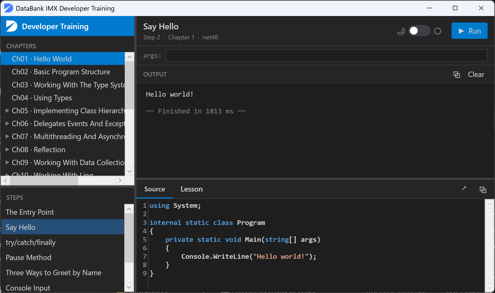
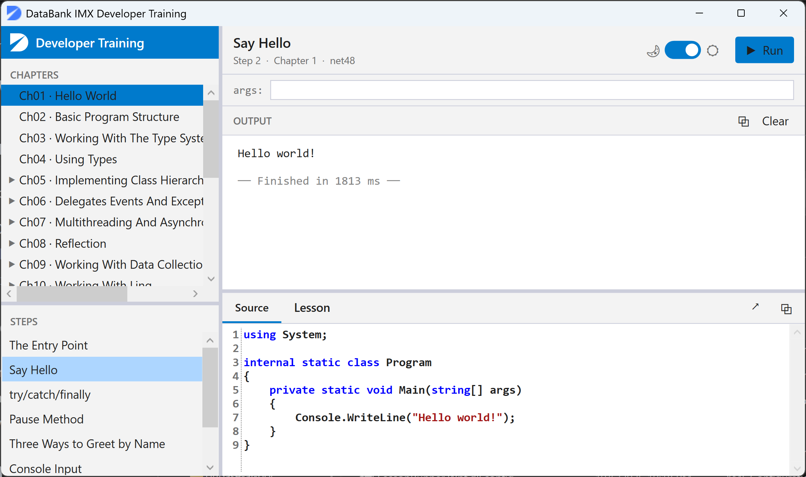
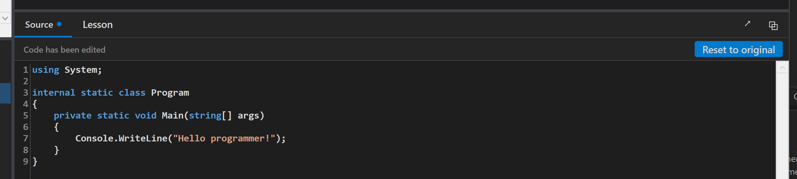
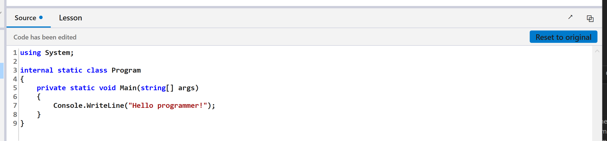
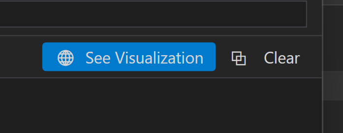
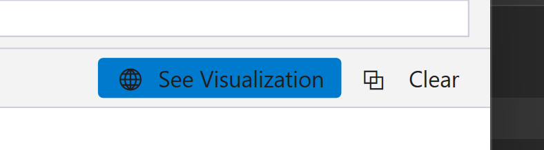
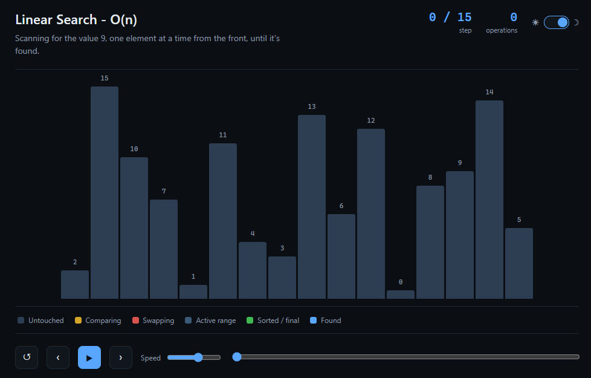
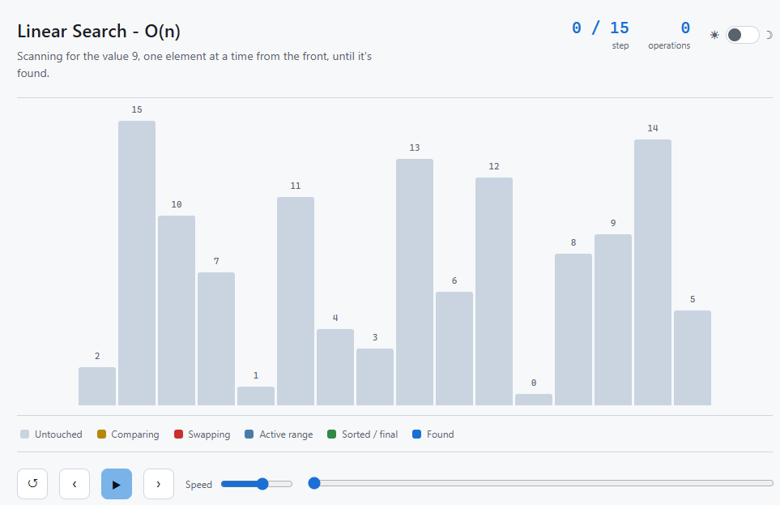
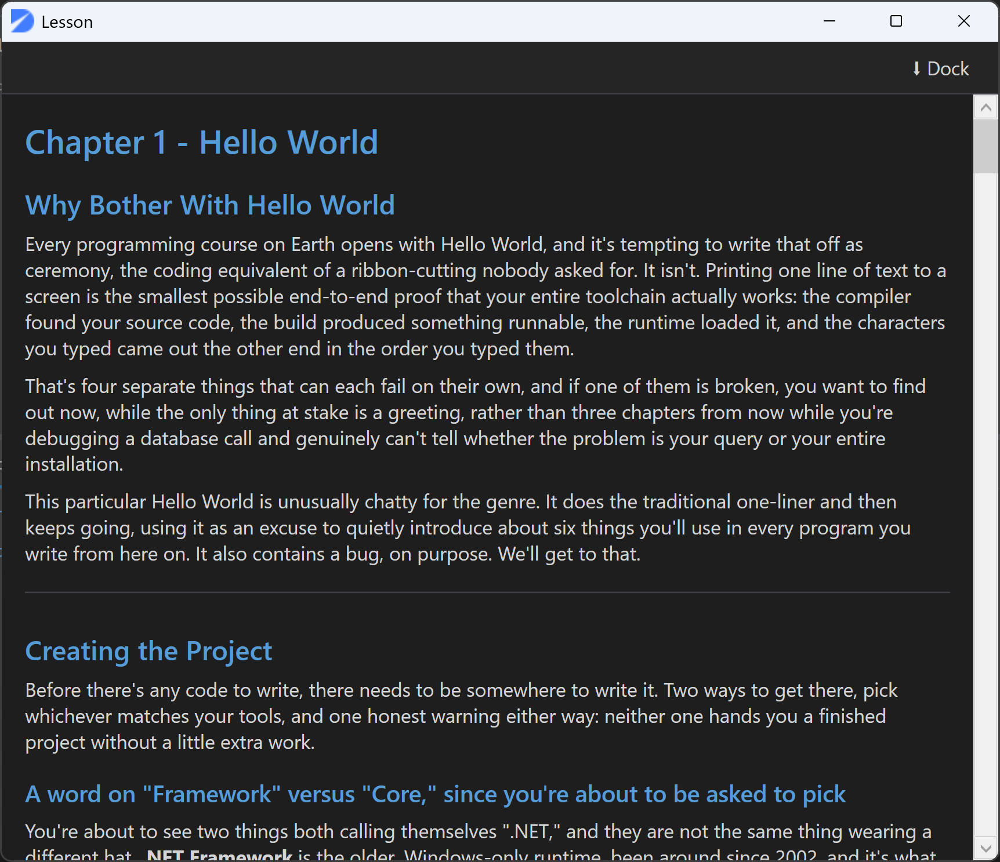
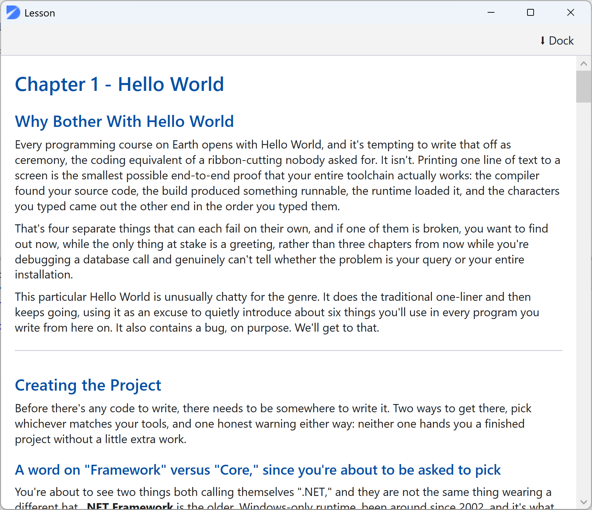

# LessonRunner - User Guide

LessonRunner is a guided C# learning environment. It presents each chapter's lesson steps one at a time, runs the code in-process using Roslyn, and streams the output to a live console pane - no project switching, no build step, no waiting.

---

## Layout

### Dark mode

### Light mode

The window has two main areas:

- **Left panel** - chapter and step navigation, split into two resizable sections
- **Right panel** - step title and controls at the top, output pane in the middle, source editor and lesson tabs at the bottom

Every divider between panels is a live splitter. Drag any of them to resize.

---

## Navigation

### Chapters (upper left)

The chapter list is populated automatically at startup from any project folder in the solution that contains a `Lessons/` directory.

- Single-click a chapter to load its steps and lesson notes.
- Chapters that have supplemental projects show a triangle expand arrow. Click the arrow to reveal supplementals as children. Clicking the chapter name itself always loads the main chapter regardless of expand state.
- Supplemental projects appear indented under their parent chapter and are selected the same way.
- Standalone supplemental topics (Big O Concepts, Data Structure Fundamentals, Search, Sort, etc.) appear at the bottom of the list, below the numbered chapters, in a fixed order.

### Steps (lower left)

Once a chapter is selected, its steps appear in the steps panel in order.

- Single-click a step to load its source code and clear the output pane.
- Selecting a new step always resets the source editor to the original step code - any edits made to the previous step are discarded.
- Use the **Up / Down arrow keys** to move between steps once the list has focus.

---

## Running a step

### Run / F5

Click **Run** or press **F5** to execute the current step. The button label changes to **Running...** while execution is in progress. Output streams to the output pane line by line as it arrives.

F5 works regardless of where keyboard focus is, including when the source editor has focus.

### Args bar

The bar labelled **args:** sits between the title bar and the output pane. Type space-separated command-line arguments here before running - they are passed to the step's `Main(string[] args)` exactly as typed. Quote arguments that contain spaces: `"hello world" foo`.

Some steps pre-fill this bar with a default argument string when selected.

### Cancelling a run

Press **Escape** while a step is running to cancel it. The output pane shows `[Run cancelled]` and the Run button is restored.

### Continue

Steps that call `GenericFunctions.Pause()` suspend mid-execution and show a **Continue** button in the output header. Click it or press **Ctrl+Shift+Enter** to resume. The button disappears once the step finishes.

### Console input

Steps that call `Console.ReadLine()` pop up an input dialog showing whatever prompt the step printed. Type your input and press Enter or click OK. The entered text is echoed to the output pane.

---

## Source editor

The source pane shows the complete C# code for the selected step. The editor is fully editable - modify the code and run it immediately with F5.

### Dirty indicator

When you edit the code, a small blue dot appears next to the **Source** tab label, and a bar appears above the editor reading **Code has been edited**.

#### Dark mode

#### Light mode

### Reset to original

Click **Reset to original** in the edit bar, or press **Escape** (when no run is in progress), to discard your edits and restore the original step code. The dirty indicator and bar disappear.

Selecting a different step also resets the editor - edits are never persisted across step selections.

### Undo / Redo

The editor supports full undo and redo while editing:

| Action | Shortcut |
|---|---|
| Undo | Ctrl+Z |
| Redo | Ctrl+Y |

### Copy source

Click the copy button in the Source/Lesson tab strip to copy the current tab's content to the clipboard. When the Source tab is active this copies the editor's current text including any edits. When the Lesson tab is active it copies the raw Markdown. A brief toast confirms the action.

---

## Output pane

The output pane shows everything the step writes to `Console.Out` and `Console.Error`. Error output and compile failures appear in red. A muted separator line shows the elapsed time when a run completes.

### Copy output

Click the copy button in the output header to copy the full output to the clipboard. A brief toast confirms the action.

### Clear

Click **Clear** to empty the output pane manually. The pane is also cleared automatically each time you click Run.

### See Visualization

Algorithm steps in the Search, Sort, and Reducing Complexity topics show a **See Visualization** button in the output header after a successful run.

#### Dark mode

#### Light mode

Clicking the button opens an interactive step-by-step animation of the algorithm in your default browser. The player has its own dark/light toggle, step-by-step and continuous playback controls, and a speed slider.

#### Dark mode

#### Light mode

The visualization button disappears when you select a different step.

---

## Lesson tab

The **Lesson** tab shows the chapter's `Lesson.md` rendered as a formatted document - headings, code samples, lists, and horizontal rules. Scroll it independently of the source editor.

### Pop-out window

Click the pop-out button at the top right of the tab strip to open the lesson in a separate window positioned to the right of the main window. This lets you read the lesson and work in the editor side by side without switching tabs.

#### Dark mode

#### Light mode

- The main window's Lesson tab shows a placeholder while the window is open.
- Close the pop-out window normally to re-dock it, or click **Dock** in the pop-out window.
- The pop-out window updates automatically when you select a different chapter.

---

## Theme

The toggle in the title bar switches between dark and light themes. The pill slides right for light, left for dark.

- **Dark theme** - VS Code-style dark background throughout.
- **Light theme** - light content panes, slightly off-white navigation sidebar, dark text.

The theme applies immediately to all panels including the source editor syntax highlighting, the rendered lesson markdown, and the pop-out lesson window. The setting is not persisted across restarts - the app always opens in dark mode.

---

## Keyboard shortcut reference

| Shortcut | Action | Condition |
|---|---|---|
| F5 | Run the current step | A step is selected |
| Escape | Cancel the current run | A run is in progress |
| Escape | Reset editor to original | Editor is dirty, no run in progress |
| Ctrl+Shift+Enter | Continue past a Pause() | Continue button is visible |
| Ctrl+Z | Undo edit | Source editor has focus |
| Ctrl+Y | Redo edit | Source editor has focus |
| Up / Down | Move between steps | Step list has focus |
| Left / Right | Collapse / expand chapter group | Chapter tree has focus |

---

## Step types

Most steps are ordinary in-process C# programs. A few behave differently:

| Type | Indicator | Behaviour |
|---|---|---|
| In-process | (none) | Compiled and run in the same process via Roslyn. Output streams live. |
| External | `[Launching as external process...]` in output | Compiled to a temporary `.exe` and launched as a subprocess. Used for steps that need COM interop, WinForms, or other dependencies not available to in-memory compilation. |
| Browser | Run button hidden; See Visualization shown immediately | Opens an HTML file in the default browser. Used for standalone algorithm visualizations. |

---

## Supplemental topics

The following standalone topics appear at the bottom of the chapter list, below the numbered chapters:

| Topic | Steps |
|---|---|
| Big O Concepts | O(1), O(n), O(log n), O(n log n), O(n^2) |
| Data Structure Fundamentals | Array, Linked List, Stack, Queue, Binary Search Tree, Trie |
| Search | Linear Search, Binary Search |
| Sort | Bubble, Selection, Insertion, Shell, Quick, Merge, Heap, Counting, Radix |
| Reducing Complexity | Worst through Best (Sieve of Eratosthenes), Miller-Rabin |
| Recursion | Naive recursive, Cached, Iterative (array), Iterative (rolling), Matrix exponentiation, Binet's formula |
| Bitwise Operations | Integer overflow, AND, Even/Odd, Bit-flags, OR, NOT, XOR, XOR encryption, Bit shifts, Iterating flags, Reconstructing integers |
| String Performance | String comparisons, StringBuilder vs concatenation |
| Factory Patterns | No Factory, Basic Factory, Improving the Pattern |

Search and Sort steps each show a See Visualization button after a successful run. The Best step under Reducing Complexity (Sieve of Eratosthenes) also has a visualization.
