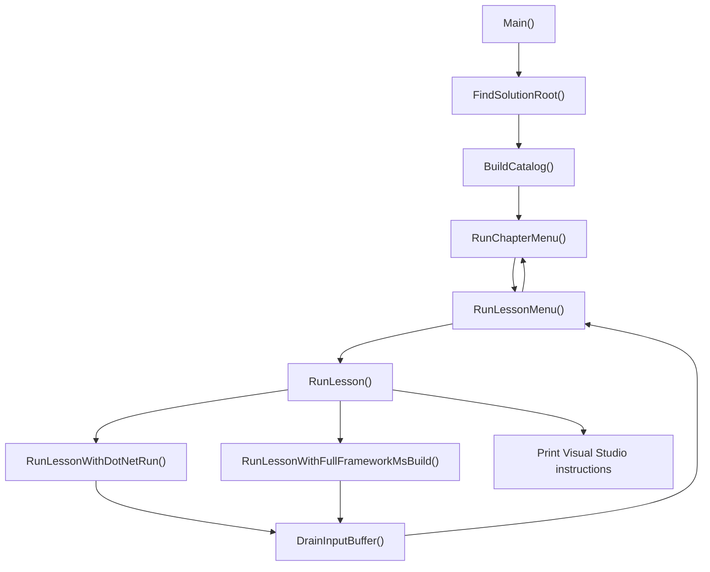

# LessonRunner

## What This Project Teaches

Every other project in this solution teaches you a language feature. This one teaches you something slightly less glamorous but far more useful in a real job: how to write the small piece of tooling that makes everything else usable.

`LessonRunner` is a console menu. You pick a chapter, you pick a lesson, it runs, and you land right back where you started so the next lesson is one keypress away. That is the entire product requirement. What makes it worth reading is everything it had to work around to deliver that requirement without becoming a maintenance burden.

Along the way you will see:

- Composing a menu system out of two nested loops and nothing else
- Modeling data with plain classes instead of reaching for the newest syntax
- Launching and waiting on child processes with `Process` and `ProcessStartInfo`
- Locating files relative to the solution instead of relative to `bin\Debug`
- Handling the two lessons that refuse to be launched the normal way
- Cleaning up console input state that a child process left behind

---

## The Shape of the Program



`Main` is deliberately boring, which is the correct amount of interesting for a `Main` method:

```csharp
private static void Main()
{
    try
    {
        string solutionRoot = FindSolutionRoot();
        var chapters = BuildCatalog();

        RunChapterMenu(chapters, solutionRoot);
    }
    catch (Exception ex)
    {
        new DatabankException("Error Caught!", ex).Log();
    }
    finally
    {
        if (!Debugger.IsAttached)
        {
            Console.WriteLine("\nDone!\n\nPress any key to exit!");
            Console.ReadKey();
        }
    }
}
```

Three statements in the `try`, the same `DatabankException` logging pattern used everywhere else in this solution, and the same `Debugger.IsAttached` guard so the window does not slam shut when you run it outside the debugger. If you have worked through Chapter 1 this should look extremely familiar, and that is on purpose.

---

## The Models: Two Classes, No Records

`Lesson` and `Chapter` are the entire data model.

```csharp
public class Chapter
{
    public string Title { get; }
    public List<Lesson> Lessons { get; }

    public Chapter(string title, List<Lesson> lessons)
    {
        Title = title;
        Lessons = lessons;
    }
}
```

```csharp
public class Lesson
{
    public string DisplayName { get; }
    public string ProjectName { get; }
    public bool RequiresFullFrameworkMsBuild { get; }
    public bool RequiresVisualStudio { get; }
    public string VisualStudioInstructions { get; }

    public Lesson(string displayName, string projectName, bool requiresFullFrameworkMsBuild = false,
        bool requiresVisualStudio = false, string visualStudioInstructions = null)
    {
        DisplayName = displayName;
        ProjectName = projectName;
        RequiresFullFrameworkMsBuild = requiresFullFrameworkMsBuild;
        RequiresVisualStudio = requiresVisualStudio;
        VisualStudioInstructions = visualStudioInstructions;
    }
}
```

Two things worth pausing on.

**Why not a `record`?** A `record` would be shorter and it would give you value equality for free. It would also fail to compile. Records depend on `init`-only accessors, and `init` accessors depend on a compiler marker type called `System.Runtime.CompilerServices.IsExternalInit`, which only exists in the BCL from .NET 5 onward. `Directory.Build.props` pins this whole solution to `net48`, so that type is simply not there. You can polyfill it by declaring the type yourself, and plenty of projects do, but for two small classes it is not worth the confusion. Plain classes with `get`-only properties and a constructor give you the same immutability with none of the archaeology.

**Why optional constructor parameters?** Because the vast majority of lessons need exactly two values, and the exceptions should look like exceptions at the call site:

```csharp
new Lesson("Textbook Lab: Lottery Program", "CSharp.Ch02.TextbookCode.LotteryProgram")
```

versus

```csharp
new Lesson("Textbook Lab: Excel Interop (WinForms, requires Excel installed)",
    "CSharp.Ch04.TextbookCode.ExcelInterop", requiresFullFrameworkMsBuild: true)
```

The named argument on the second one is doing real documentation work. Someone skimming the catalog can see at a glance which lessons are special without knowing anything about the `Lesson` constructor signature.

---

## The Catalog

`BuildCatalog()` is the only place that needs to change when the solution grows a new chapter or lesson. It is one giant collection expression:

```csharp
private static List<Chapter> BuildCatalog()
{
    return
    [
        new Chapter("Chapter 1 - Hello World",
        [
            new Lesson("Hello World", "CSharp.Ch01.HelloWorld")
        ]),

        new Chapter("Chapter 2 - Basic Program Structure",
        [
            new Lesson("Basic Program Structure (Full Lesson)", "CSharp.Ch02.BasicProgramStructure"),
            new Lesson("Textbook Lab: Using If Statements", "CSharp.Ch02.TextbookCode.UsingIfStatements"),
            new Lesson("Textbook Lab: Lottery Program", "CSharp.Ch02.TextbookCode.LotteryProgram"),
            new Lesson("Textbook Lab: Average Grades", "CSharp.Ch02.TextbookCode.AverageGrades"),
            new Lesson("Textbook Lab: Working with For Loops", "CSharp.Ch02.TextbookCode.WorkingWithForLoops")
        ]),

        // ...chapters 3 through 12 follow the same shape
    ];
}
```

Those bare `[ ... ]` brackets are C# 12 collection expressions. Note that they compile fine on `net48`, unlike records, because they lower to ordinary collection initializer calls that do not need any new BCL types. Language version and runtime version are two separate axes, and this project is a nice illustration of where the line falls.

**Order is deliberate and not alphabetical.** `CSharp.Ch02.TextbookCode.LotteryProgram` appears before `CSharp.Ch02.TextbookCode.AverageGrades` because that is the order `BasicProgramStructure` actually walks through them. Alphabetical sorting would put `AverageGrades` first and quietly teach the chapter backwards. If you ever feel tempted to add a `.OrderBy(l => l.DisplayName)` here, resist.

The catalog also carries operational notes right in the display name:

```csharp
new Lesson("Supplemental 01: ADO.NET and Entity Framework (requires SQL Server, see README.md)",
    "CSharp.Ch09.Supplemental.01.AdoNetAndEntityFramework")
```

That parenthetical is the cheapest possible documentation. Someone with no SQL Server instance sees the prerequisite before they pick the option, not after they get a connection timeout.

---

## The Two Menus

The chapter menu and the lesson menu are nearly identical, and that repetition is intentional rather than accidental. Both are `while (true)` loops that redraw, read a line, and dispatch.

```csharp
private static void RunChapterMenu(List<Chapter> chapters, string solutionRoot)
{
    while (true)
    {
        Console.Clear();
        Console.WriteLine("DataBank IMX Developer Training");
        Console.WriteLine("================================");
        Console.WriteLine();
        Console.WriteLine("Select a chapter:");
        Console.WriteLine();

        for (int i = 0; i < chapters.Count; i++)
        {
            Console.WriteLine($"  {i + 1}. {chapters[i].Title}");
        }
        Console.WriteLine();
        Console.WriteLine("  X. Exit");
        Console.WriteLine();
        Console.Write("Choice: ");

        string choice = Console.ReadLine()?.Trim() ?? "";

        if (string.Equals(choice, "X", StringComparison.OrdinalIgnoreCase)) return;

        if (int.TryParse(choice, out int selection) && selection >= 1 && selection <= chapters.Count)
        {
            bool exitProgram = RunLessonMenu(chapters[selection - 1], solutionRoot);
            if (exitProgram) return;
        }
        else
        {
            Console.WriteLine();
            Console.WriteLine("That's not a valid choice. Press any key to try again...");
            Console.ReadKey();
        }
    }
}
```

Points of technique in that one method:

- `Console.ReadLine()?.Trim() ?? ""` handles the case where standard input has been closed and `ReadLine` returns `null`. The null-conditional and null-coalescing operators together mean the rest of the method never has to think about it.
- `StringComparison.OrdinalIgnoreCase` rather than `choice.ToUpper() == "X"`. No allocation, no culture surprises, and it is the comparison the framework actually wants you to use for symbolic input.
- `int.TryParse` rather than `int.Parse` in a `try` block. Invalid input from a human is expected control flow, not an exceptional condition. Exceptions are expensive and this is a menu.
- The range check `selection >= 1 && selection <= chapters.Count` runs before the `chapters[selection - 1]` index. `TryParse` will happily succeed on `9999`.

The lesson menu adds one wrinkle: it needs to communicate two different kinds of exit back to its caller.

```csharp
// Returns true if the person chose to exit the whole program from here,
// false if they chose to go back to the chapter menu instead.
private static bool RunLessonMenu(Chapter chapter, string solutionRoot)
{
    while (true)
    {
        Console.Clear();
        Console.WriteLine(chapter.Title);
        Console.WriteLine(new string('=', chapter.Title.Length));
        // ...

        if (string.Equals(choice, "B", StringComparison.OrdinalIgnoreCase)) return false;
        if (string.Equals(choice, "X", StringComparison.OrdinalIgnoreCase)) return true;

        if (int.TryParse(choice, out int selection) && selection >= 1 && selection <= chapter.Lessons.Count)
        {
            RunLesson(chapter.Lessons[selection - 1], solutionRoot);

            Console.WriteLine();
            Console.WriteLine("Press any key to return to the lesson menu...");
            Console.ReadKey();
            // Falls through and redisplays this same lesson menu once acknowledged
        }
        // ...
    }
}
```

A `bool` return is not the most expressive thing in the world, but with exactly two outcomes it beats inventing an enum. The comment above the method carries the meaning, and the two `return` statements sit right next to each other so there is no hunting.

`new string('=', chapter.Title.Length)` is a small pleasure: an underline that is always exactly as long as the title above it, with no format strings involved.

---

## Running a Lesson

Here is the architectural decision that shapes the whole project. `LessonRunner` does **not** reference the lesson projects. It runs them as child processes.

The alternative would have been a project reference to all seventy-odd lesson projects plus a call into each one's entry point. That would mean editing `LessonRunner.csproj` and rebuilding it every single time someone adds a lesson, and it would mean every lesson's `Main` becoming a public method just to make it callable. Look at how small the project file stayed instead:

```xml
<Project Sdk="Microsoft.NET.Sdk">

  <PropertyGroup>
    <OutputType>Exe</OutputType>
    <RootNamespace>LessonRunner</RootNamespace>
    <AssemblyName>LessonRunner</AssemblyName>
  </PropertyGroup>

  <ItemGroup>
    <ProjectReference Include="..\CSharp.SharedLibrary\CSharp.SharedLibrary.csproj" />
  </ItemGroup>

</Project>
```

One reference, and only for `DatabankException`. Adding a lesson means adding a single line to `BuildCatalog()`.

`RunLesson` is the dispatcher for three cases:

```csharp
private static void RunLesson(Lesson lesson, string solutionRoot)
{
    if (lesson.RequiresVisualStudio)
    {
        Console.Clear();
        Console.WriteLine($"{lesson.DisplayName} can't be launched from LessonRunner.");
        Console.WriteLine();
        Console.WriteLine(lesson.VisualStudioInstructions ?? "Open this project's .csproj in Visual Studio and run it from there.");
        return;
    }

    string projectDirectory = Path.Combine(solutionRoot, lesson.ProjectName);
    string projectFile = Path.Combine(projectDirectory, $"{lesson.ProjectName}.csproj");

    if (!File.Exists(projectFile))
    {
        Console.WriteLine();
        Console.WriteLine($"Could not find {projectFile}");
        Console.WriteLine("Press any key to return to the lesson menu...");
        Console.ReadKey();
        return;
    }

    Console.Clear();

    if (lesson.RequiresFullFrameworkMsBuild)
    {
        RunLessonWithFullFrameworkMsBuild(lesson, projectDirectory, projectFile);
    }
    else
    {
        RunLessonWithDotNetRun(lesson, projectDirectory, projectFile);
    }

    DrainInputBuffer();
}
```

Notice that `ProjectName` is doing triple duty: it is the folder name, the `.csproj` base name, and the built `.exe` name. Every project in this solution keeps those three identical, which is a convention rather than a rule, and this method is the reason the convention is worth keeping.

Also notice `Path.Combine` instead of string concatenation with backslashes. It is not about cross-platform portability here, since half these lessons are WinForms. It is about not producing `C:\dev\training\\CSharp.Ch01.HelloWorld` when someone's root path ends in a separator.

### The normal path

```csharp
private static void RunLessonWithDotNetRun(Lesson lesson, string projectDirectory, string projectFile)
{
    var startInfo = new ProcessStartInfo
    {
        FileName = "dotnet",
        Arguments = $"run --project \"{projectFile}\" --nologo",
        WorkingDirectory = projectDirectory,
        UseShellExecute = false
    };

    try
    {
        using var process = Process.Start(startInfo);
        process?.WaitForExit();

        if (process != null && process.ExitCode != 0)
        {
            Console.WriteLine();
            Console.WriteLine($"[{lesson.DisplayName}] exited with a non-zero code ({process.ExitCode}), scroll up to see what it printed.");
        }
    }
    catch (Exception ex)
    {
        new DatabankException($"Error running lesson [{lesson.DisplayName}]!", ex).Log();
        Console.WriteLine();
        Console.WriteLine("Press any key to return to the lesson menu...");
        Console.ReadKey();
    }
}
```

`UseShellExecute = false` is the load-bearing property. Set it to `true` and Windows launches the process through the shell, which gives it a brand new console window. The lesson would appear in its own window, print everything, and vanish. With it set to `false`, the child process inherits this console's standard handles, so the lesson's output appears inline right where you are already looking.

`dotnet run` also builds the project first if it is out of date, which means you never have to remember to rebuild the solution before trying a lesson you just edited.

The embedded quotes around `{projectFile}` matter more than they look. Plenty of developers have paths containing spaces, and without those quotes `dotnet` would see `C:\My` and `Projects\...` as two separate arguments.

### The COM interop path

One lesson, `CSharp.Ch04.TextbookCode.ExcelInterop`, uses a `<COMReference>` to talk to Excel. That reference requires MSBuild's `ResolveComReference` task, and the MSBuild bundled with the `dotnet` SDK simply does not implement it:

```
MSB4803: The task "ResolveComReference" is not supported on the .NET Core version of MSBuild
```

This is not a machine configuration problem you can fix. `dotnet build` will never build that project on any machine. The full .NET Framework `MSBuild.exe` that ships with Visual Studio can, so the workaround is to find it and use it:

```csharp
private static string FindFullFrameworkMsBuild()
{
    string vswherePath = Path.Combine(
        Environment.GetFolderPath(Environment.SpecialFolder.ProgramFilesX86),
        "Microsoft Visual Studio", "Installer", "vswhere.exe");

    if (!File.Exists(vswherePath)) return null;

    var startInfo = new ProcessStartInfo
    {
        FileName = vswherePath,
        Arguments = "-latest -requires Microsoft.Component.MSBuild -find MSBuild\\**\\Bin\\MSBuild.exe",
        UseShellExecute = false,
        RedirectStandardOutput = true
    };

    using var process = Process.Start(startInfo);
    string output = process?.StandardOutput.ReadToEnd() ?? "";
    process?.WaitForExit();

    string path = output
        .Split(['\r', '\n'], StringSplitOptions.RemoveEmptyEntries)
        .FirstOrDefault();

    return !string.IsNullOrWhiteSpace(path) && File.Exists(path) ? path : null;
}
```

`vswhere.exe` is Microsoft's official answer to "where did Visual Studio get installed this time." It lands at a fixed path under Program Files (x86) alongside any VS 2017 or later install, and it will tell you about installs it did not put there. Hardcoding `C:\Program Files\Microsoft Visual Studio\2026\Enterprise\...` would work on exactly one machine.

Here `RedirectStandardOutput = true` is the opposite choice from the lesson launcher, because this time we want to capture the output rather than show it. Note also that `Environment.GetFolderPath` is used instead of hardcoding the Program Files path, since that string is localized on some Windows installs.

Once MSBuild is located, the project is built and the resulting executable is launched directly:

```csharp
// Directory.Build.props pins every project in this solution to net48
string exePath = Path.Combine(projectDirectory, "bin", "Debug", "net48", $"{lesson.ProjectName}.exe");

if (!File.Exists(exePath))
{
    Console.WriteLine();
    Console.WriteLine($"Build succeeded but could not find {exePath}");
    return;
}
```

That comment about `Directory.Build.props` is earning its keep. The hardcoded `net48` in the path looks fragile in isolation, and the comment tells the next reader exactly which file makes it safe and where to look if it ever stops being true.

### The "cannot run at all" path

`CSharp.Ch09.TextbookCode.NorthwindsWCFDataService` is an IIS-hosted WCF Data Service. It is a `.svc` file. There is no executable, and there is no `dotnet run` equivalent for "host this in IIS Express the way Visual Studio does." Rather than fail with something cryptic, the catalog carries the instructions:

```csharp
new Lesson("Textbook Lab: Northwinds WCF Data Service (Visual Studio only)",
    "CSharp.Ch09.TextbookCode.NorthwindsWCFDataService",
    requiresVisualStudio: true,
    visualStudioInstructions:
        "This is an IIS-hosted WCF Data Service (a .svc file, no standalone .exe), it\n" +
        "needs Visual Studio's own IIS Express integration to run, there's no \"dotnet\n" +
        "run\" equivalent for that.\n\n" +
        "1. Open CSharp.Ch09.TextbookCode.NorthwindsWCFDataService\\CSharp.Ch09.TextbookCode.NorthwindsWCFDataService.csproj in Visual Studio\n" +
        "2. Make sure the \"Northwinds\" database is set up (see NorthwindsConsole's README.md)\n" +
        "3. Press F5, or right-click NorthwindsService.svc and choose \"View in Browser\"\n\n" +
        "See this project's own LectureNotes.md for further detail.")
```

This is a good general habit. When your tool cannot do something, the most valuable thing it can produce is a precise description of what the human should do instead.

---

## The Bug You Would Never Have Predicted

`DrainInputBuffer` exists because of a genuinely subtle problem:

```csharp
private static void DrainInputBuffer()
{
    try
    {
        while (Console.KeyAvailable)
        {
            Console.ReadKey(intercept: true);
        }
    }
    catch (InvalidOperationException)
    {
        // Console.KeyAvailable/ReadKey throw when input is redirected, nothing to drain there.
    }
}
```

Because the lesson shares this console rather than getting its own window, keystrokes typed during the lesson go into the same input buffer `LessonRunner` will read from next. Someone mashing keys at a "press any key" prompt that already passed leaves those characters sitting there. When control returns here, the very next `Console.ReadLine()` silently picks them up and prepends them to whatever the user types, turning a perfectly good `X` for Exit into `jjjX`, which parses as nothing and produces "that's not a valid choice."

Two details:

- `intercept: true` reads the key without echoing it to the screen. Without it, draining the buffer would splatter the leftover characters across the console.
- The `catch (InvalidOperationException)` handles redirected input. `Console.KeyAvailable` throws when there is no real console attached, such as when output is being piped in a build script. Swallowing that specific exception, with a comment explaining exactly why, is appropriate. Swallowing a bare `Exception` here would not be.

---

## Finding the Solution Root

The last piece solves a problem every tool eventually hits: the executable does not live where its data lives.

```csharp
private const string SolutionFileName = "DataBank.DeveloperTraining.sln";

private static string FindSolutionRoot()
{
    var directory = new DirectoryInfo(AppContext.BaseDirectory);

    while (directory != null)
    {
        if (File.Exists(Path.Combine(directory.FullName, SolutionFileName)))
        {
            return directory.FullName;
        }
        directory = directory.Parent;
    }

    throw new DatabankException($"Could not locate {SolutionFileName} above {AppContext.BaseDirectory}");
}
```

`AppContext.BaseDirectory` is where the assembly actually is, which is somewhere down in `bin\Debug\net48`. Walking up parent directories until the `.sln` turns up means it does not matter whether you started via `dotnet run`, F5 in Visual Studio, or by double-clicking the built `.exe` from Explorer. All three land in different working directories, and all three find the same solution root.

The loop terminates because `DirectoryInfo.Parent` returns `null` at a drive root. If it gets there without finding the file, throwing beats returning `null` and letting every lesson path silently resolve to garbage.

This is the standard "walk up looking for a marker file" pattern, and you have used it many times without noticing. It is how git finds `.git`, how npm finds `package.json`, and how MSBuild finds `Directory.Build.props`.

---

## Key Takeaways

- **Process boundaries can be an architecture choice.** Launching lessons as child processes instead of referencing them kept this project's dependency list at exactly one entry and made adding a lesson a one-line change.
- **`UseShellExecute = false` inherits the console.** That single property is the difference between output appearing inline and a window flashing past.
- **Language version and runtime version are independent.** Collection expressions work on `net48`. Records do not, because they need a BCL type that is not there.
- **`TryParse` over `Parse` for human input.** Bad menu input is normal, not exceptional.
- **Locate paths from a marker file, not from the working directory.** `AppContext.BaseDirectory` plus a parent walk survives every launch method.
- **When the tool cannot do the job, say precisely what will.** The `RequiresVisualStudio` path produces better output than any error message could.
- **Catch narrowly and comment why.** `catch (InvalidOperationException)` around `Console.KeyAvailable` is a real fix. `catch (Exception)` there would have been a shrug.

---

## Adding a New Chapter or Lesson

Open `BuildCatalog()`. Add a `Lesson` to an existing `Chapter`, or a whole new `Chapter` to the returned list. Put it in teaching order, not alphabetical order. If the project has prerequisites, put them in the display name inside parentheses so people read them before they choose. If it needs full framework MSBuild or cannot be launched at all, set the relevant optional parameter using a named argument so it stands out.

That is the whole maintenance story. No project reference, no rebuild of anything but this one project.